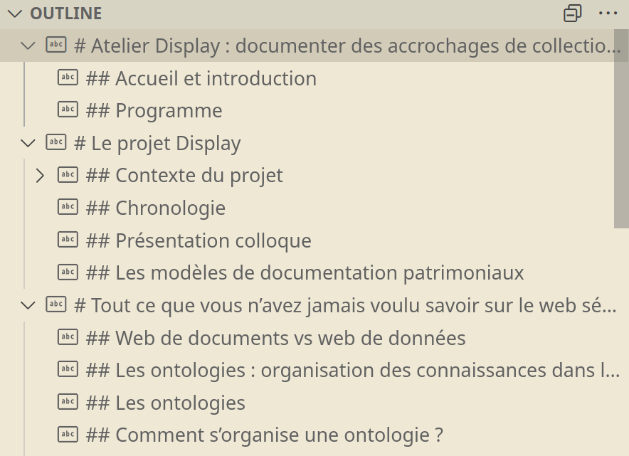

# Diapositives pour Display

Sources des diapositives utilisées dans le cadre du projet Display (Ouvroir d’histoire de l’art et de muséologie numériques).

- [2024-12-17](./documenting/2024-12-17-documenting.md) : [Documenting Exhibitions with the Semantic Web](./documenting/)
- [2024-10-28](./atelier/2024-10-28-atelier.md) : [Atelier Display](./atelier/)
- [2024-08-07](./dh2024/2024-08-07-dh2024.md) : [DH2024](./dh2024/)
- [2025-06-17](./interface/2025-06-16.md) : [interface](./interface/)
# Mode d’emploi

## Branche de travail

Pour éviter de déclencher le déploiement à chaque push, on travaille sur la branche `edit`.

## Niveau des titres

- **titre de niveau 1 (#) :** titre pour les colonnes de diapositives
- **titre de niveau 2 (##) :** titre pour les diapositives

De cette façon, dans le plan de la présentation (outline), les titres de niveau 1 indiquent les colonnes de diapositives, tandis que les titres de niveau 2 indiquent les diapositives :



## Syntaxe

### Diapos et colonnes

- ajouter une colonne : `===>>>>>>===`, suivi d’un titre de niveau 1
- ajouter une diapositive : `===vvvvvv===`, suivi d’un titre de niveau 2

Il est possible de n’afficher que le titre de niveau 1 sur la diapositive d’entête de colonne.

### Background image

À insérer immédiatement après le marqueur de nouvelle diapositive :

```
<!-- .slide:
data-background-image="./img/use-case-00-front.jpeg" data-background-size="auto 100%"
-->
```

### `<iframe>`

À insérer immédiatement après le marqueur de nouvelle diapositive :

```
<!-- .slide:
data-background-iframe="https://ouvroir.github.io/display-ontology/webvowl/index.html" data-background-interactive class="stack"
-->
```

### Cacher une diapositive

À insérer immédiatement après le marqueur de nouvelle diapositive :

`<!-- .slide: data-visibility="hidden" -->`

### Speaker notes

à insérer avant le marqueur de prochaine diapositive ou colonne :

```
/** Notes **/

- bla
- bla
```

La syntaxe MD fonctione aussi dans les speaker notes.

## Modèles

### Image avec légende ou crédits

```html
<figure>
  
  <figcaption>
    La pile technologique du web sémantique.
  </figcaption>
</figure>
```

### Diapositive en deux colonnes

```html
<div style="display: flex">
  <div class="flex-1">
    <p>Colonne 1, à gauche. Lorem ipsum dolor patente.</p>

    - descriptions et représentions plus fluides
    - mises en relation plus complexes des objets
  </div>
  <div class="flex-1">
    <p>Colonne 2. Lorem.</p>
  </div>
</div>
```

**Note :** à l'intérieur de l'élément `div`, il faut expliciter l'élément `p`.

### Deux colonnes avec image et légende

```html
<div class="flex">
  <div class="flex-1">
    <p>Paragraphe dans la colonne 1.</p>

  - liste dans
  - la colonne 1
  </div>
  <div class="flex-1">
    <figure>
      
      <figcaption>
        Exemple de graphe orienté acyclique (<a href="https://commons.wikimedia.org/wiki/File:Directed_acyclic_graph.svg">publié dans le domaine public par David W.</a>)
      </figcaption>
    </figure>
  </div>
</div>
```

L'attribut `style` est facultatif. Le style peut être défini ailleurs selon les approches habituelles.
