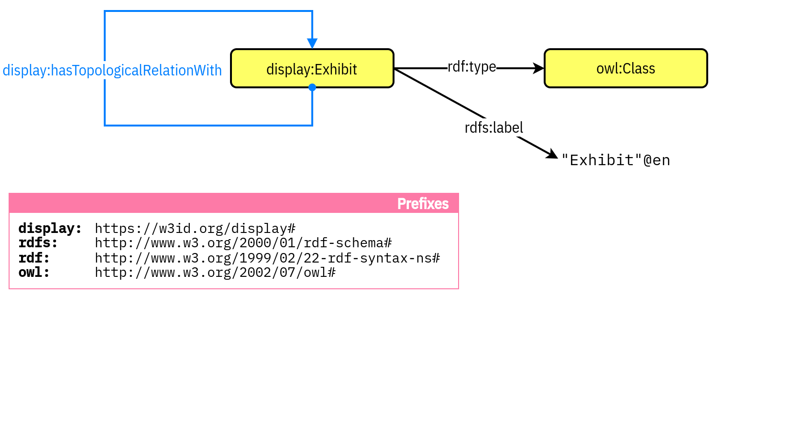
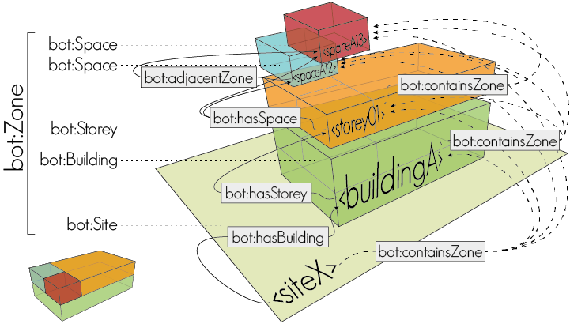
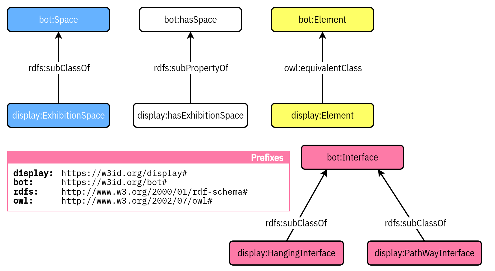
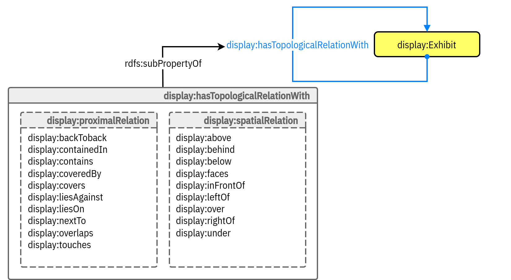
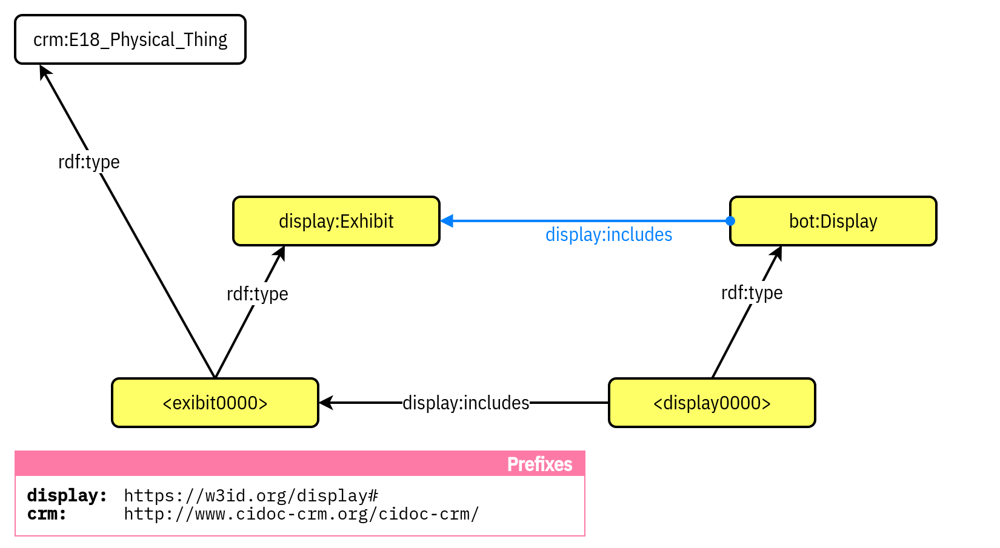
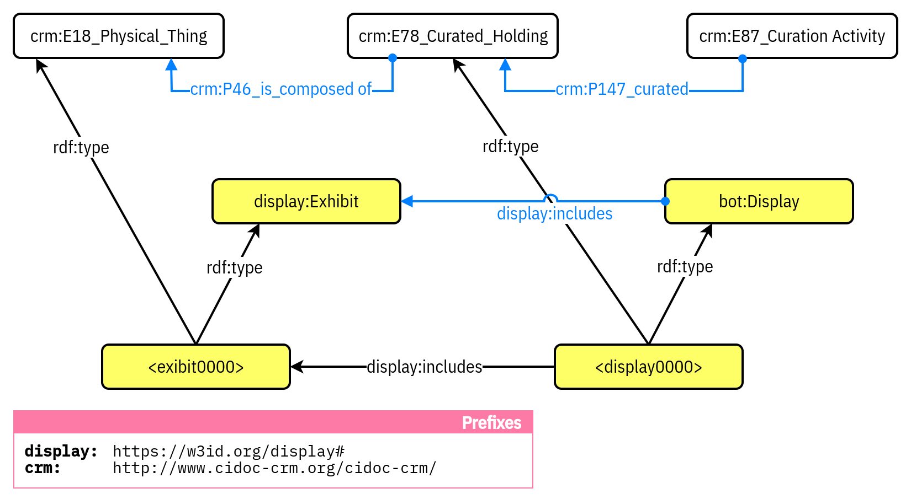

<!-- ’ -->

# Documenting Exhibitions with the Semantic Web

**Zoë&#0160;Renaudie, David&#0160;Valentine et Emmanuel Château-Dutier**

December 17 2024 🎄🎅🎄

  

    
  

  

    
  

  

    
  

===vvvvvv===

# ECD

===vvvvvv===

===vvvvvv===

## Welcome

===vvvvvv===

## Programme

1. Accueil et introduction
1. L’ontologie Display
1. L’application Display
1. Atelier

===>>>>>>===

# ZR Le projet Display

===vvvvvv===

## Contexte du projet

### Nouveaux usages des collections dans les musées d’art

- Partenariat CRSH
- ~20 chercheurs, 6 musées canadiens
- Axe 1 : *La collection exposée* (Marie Fraser dir.)
- [www.cieco.co](https://www.cieco.co)

### Ouvroir d’histoire de l’art et de muséologie numériques

- Laboratoire destiné à supporter la recherche
- [ouvroir.umontreal.ca](https://ouvroir.umontreal.ca)

===vvvvvv===

## Chronologie

- 2021 : définition des besoins avec les acteurs de l’axe 1
- 2022 : étude des outils existants
- 2023 : développement de l’ontologie
- 2024 : cahier des charges fonctionnel
- 2025 : développement de l’application

===vvvvvv===

## Présentation colloque

- Journée d’étude CIECO 2023, Réflexions pour un modèle de documentation des accrochages de collection (Marie + Emmanuel + Lena)
- vitrine du CRIHN : présentation des premières expérimentations : démo de visualisation et de requêtes SPARQL
- DHNB2024 Reykjavik : présentation du projet Display
- DH2024 : présentation de l’ontologie Display

===vvvvvv===

## Les modèles de documentation patrimoniaux

- [CIDOC-CRM](http://www.cidoc-crm.org)
- [CRMgeo](doi:[10.1007/s00799-016-0192-4](https://doi.org/10.1007/s00799-016-0192-4).): A Spatiotemporal Extension of CIDOC-CRM
- [Art Tracks](http://www.museumprovenance.org)
- [OntoExhibit](https://complexhibit-project.github.io/OntoExhibit/index-en.html)
- [CRMaaa ontology](https://ontome.net/namespace/246)

**Jusqu’à présent, pas de modèle spécialisé pour la documentation des expositions ou des accrochages**

===>>>>>>===

# DV L’ontologie Display

===vvvvvv===

## L’ontologie Display

Notre conceptualisation de la topologie de l’exposition.

Accessible en ligne : [https://w3id.org/display](https://ntnlv.ca/display/)

### Survol

- Domaine de connaisances  la topologie de l’exposition
- Classes centrales : l’espace et l’expôt
- Propriétés topologiquea pour reconstituer (décrire) l’espace

===vvvvvv===

## Display : Ontological Core

A perspective on the exhibition based on:

- concept of *Exhibit*
- spatial logics (definition of abstract topological relationships)

===vvvvvv===

## Display : The Main Conceptualization

- everything takes place in exhibition spaces
- every exhibition entity (artistic or technical) is an *Exhibit*

/** Notes **/

- And that is the conceptualization we want to share with the museology community using the semantic web tools.

===vvvvvv===

## Display : The Exhibit Class

`display:Exhibit`

===vvvvvv===

## Handling Description of Space

Reusing the Building Topology Ontology

> The Building Topology Ontology (BOT) is a minimal OWL DL ontology for defining relationships between the sub-components of a building.  
> (Rasmussen et al., 2021b)

Specification: https://w3c-lbd-cg.github.io/bot/
Namespace: `https://w3id.org/bot#`

===vvvvvv===

## Handling Description of Space

The Building Topology Ontology (BOT)

<figure class="w75">
  
  <figcaption>Classes and relationships involved in Zones (Rasmussen et al., 2021b)</figcaption>
</figure>

===vvvvvv===

## The `bot:` & `display:` Alignment Strategy

===vvvvvv===

## Display : Handling Tolopogical Relationships

===vvvvvv===

<!-- .slide: data-background-iframe="https://ouvroir.github.io/display-ontology/webvowl/index.html" data-background-interactive class="stack" -->

===vvvvvv===

## Linkage with CIDOC and heritage ontologies

===vvvvvv===

## Linkage with CIDOC and heritage ontologies

===>>>>>>===

# Discussions, etc.

===vvvvvv===

# Topics, etc.

- topology
- etc.

===>>>>>>===

# Conclusion

The Display ontology

- can describe complex curatorial phenomena in fine detail 
- offers enough expressivity to leverage the ontological model through inferences

===vvvvvv===

Focusing on the expographic configuration `but` compatible with CIDOC-CRM

**Semantic web technologies provide an abstract model for effectively reasoning about incomplete and sometimes contradictory documentation.**

===vvvvvv===

## Merci !

- Display ontology  [https://ouvroir.github.io/display-ontology/](https://ouvroir.github.io/display-ontology/)
- [ouvroir.umontreal.ca](https://ouvroir.umontreal.ca)

  

    
  

  

    
  

  

    
  

  

