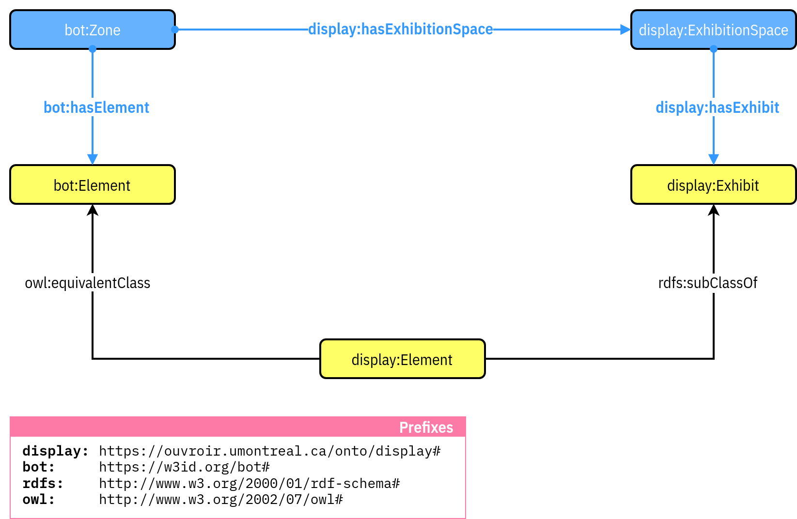
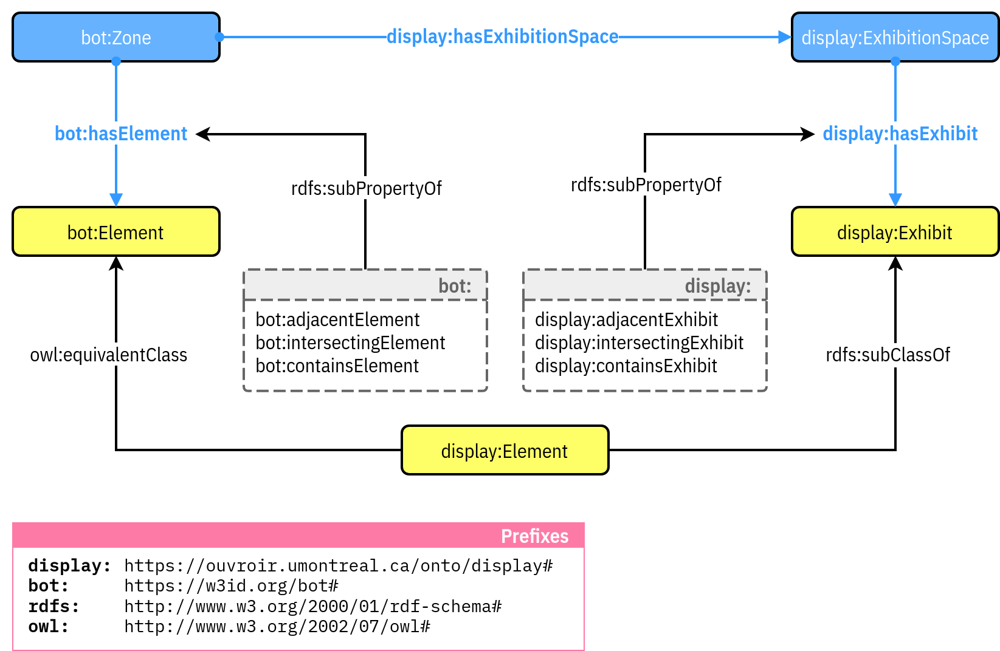

<!-- ’ -->
<style display="none">
.flex {
  display: flex;
}
.flex-1 {
  flex: 1;
}
.flex-1-5 {
  flex: 1.5;
}
#ouvroir {
  position: relative;
  right: 10%;
}
#cieco {
  max-width: 50%;
  position: relative;
	left: 5%;
}
#udem {
  margin-top: 0;
  postion: relative;
  bottom: 15%;
}
.reveal h3 {
  margin-top: 1em;  
}
.reveal .logos {
  margin-top: 2em;
}
</style>

# Documenting Exhibitions with the Semantic Web

**Zoë&#0160;Renaudie, David&#0160;Valentine et Emmanuel Château-Dutier**

December 17, 2024

<div class="logos flex">
  <div class="flex-1">
    
  </div>
  <div class="flex-1">
    
  </div>
  <div class="flex-1">
    
  </div>
</div>

===vvvvvv===

## Welcome

===vvvvvv===

## Programme

8:30 AM – 8:45 AM: Welcome and introduction to the event and the Ouvroir lab (15 min)  

8:45 AM – 10:00 AM: Presentations (15 min each) in this order :

- Display Ontology (presented by our team)  
- Nuria Rodríguez-Ortega  
- Anaïs Guillem  
- Nicola Carboni  
- George Bruseker  

10:00 AM – 10:15 AM: Break  

10:15 AM – 12:30 PM: Round Table

===vvvvvv===

## New uses of collections in art museums

- SSHRC Partnership
- ~20 researchers, 6 canadian museums
- First axis : *Exhibited Collections* (Marie Fraser dir.)
- [www.cieco.co](https://www.cieco.co)

### Ouvoir d’histoire de l’art et de muséologie numériques

- Digital lab to support the research
- [ouvroir.umontreal.ca](https://ouvroir.umontreal.ca)

===vvvvvv===
<!-- .slide: data-visibility="hidden" -->
## Cultural heritage documentation models

- [CIDOC-CRM](http://www.cidoc-crm.org)
- [CRMgeo](doi:[10.1007/s00799-016-0192-4](https://doi.org/10.1007/s00799-016-0192-4).): A Spatiotemporal Extension of CIDOC-CRM
- Art Tracks http://www.museumprovenance.org
- [OntoExhibit](https://complexhibit-project.github.io/OntoExhibit/index-en.html) (other presentation in this conference)
- [CRMaaa ontology](https://ontome.net/namespace/246)

**to date, there is no specialized model for the documentation of exhibition or collection diplays**

===vvvvvv===
<!-- .slide: data-visibility="hidden" -->
## Why Focus on the Semantic Model?  

It drives the tool’s capabilities, ensuring:  

- **Data durability**  
- **Interoperability** across digital platforms  
- Adaptability to new technologies  

===>>>>>>===

# Documenting exhibition and collection displays


===vvvvvv===

## A Spatial Approach to Exhibitions  

The *Display* project develops a tool to support exhibition research by:  
- Collecting and analyzing archival data  
- Documenting findings  
- Generating hypotheses  

### Key Features  

- Visualizing exhibitions spatially: **diagrams or 3D models**  
- Bridging gaps in incomplete documentation  
- Enabling **collaborative workflows** for research teams  

===vvvvvv=== 

## From Documentation to 3D Visualization  

Unlike architecture or archaeology, museology lacks "constructive logic" for modeling exhibitions.  
- Exhibition sources: archival documents and photographs  
- Require specialized approaches to reconstruction  

### How *Display* Solves This  

- Supports the full workflow: data collection → hypotheses → 3D reconstructions  
- Powered by an **OWL ontology** to handle uncertainties and gaps in documentation  

 ===vvvvvv=== 

## A tool for studying exhibitions

The *Display* tool redefines how we study exhibitions by:  

- Incorporating **spatial logic** to enhance reconstructions  
- Bridging historical gaps with innovative modeling approaches  
- Ensuring long-term usability and relevance  

**A new way to understand exhibition history through durable, interoperable, and collaborative digital tools.**  

===>>>>>>===

## The Display Ontology

An ontology for the topology of the exhibition


- Namespace: [`https://w3id.org/display#`](https://w3id.org/display/)
- Prefix: `display:`

### Approach

- Knowledge domain: the topology of the exhibition
- Structure: few classes, variety of relations
- Independent of visualization: historical uncertainties may coexist

/** Notes **/

- So this tool is based on the Display Ontology, which is a model for describing the topology of exhibition, that we have developed here at L'Ouvroir.
- And we first took a very simple approach to do that.

**Structure**

- we were looking at a way to describe topological relationship in a very straight forward manner
- and we wanted something that was simple, and that was close to the way we describe topological facts in the natural language so we needed some flexibility.
- As you will see we use a simple structure.

**Independent of visualization**

- And we start by an ontological approach because that kind of model doesn't need us to know everything about an exhibition in order to make sense out of the data.

===vvvvvv===

## Display : Ontological Core

A perspective on the exhibition based on:

- concept of *Exhibit*
- spatial logics (definition of abstract topological relationships)

/** Notes **/

- The Display ontology defines a set of classes and properties for describing exhibitions.
- It adopts an expographic perspective based on the concept of exhibit, mobilizing mainly a spatial logic that implies being able to define topological relationships between exhibit and exhibition spaces.

===vvvvvv===

## Display : The Main Conceptualization

- everything takes place in exhibition spaces
- every exhibition entity (artistic or technical) is an *Exhibit*

/** Notes **/

- So we adopt a particular point of view on the exhibition, in the sense that:
  - everything takes place in expographic, or exhibition spaces
  - all objects located in such spaces are exhibits

===vvvvvv===

## Display : The Exhibit Class

`display:Exhibit`


/** Notes **/

- The `display:Exhibit` class is used to bring together elements involved in an exhibition, regardless of their artistic, aesthetic or technical characteristics, through the topological relationships they have with each other within an exhibition space.
- As you can see again it's a very simple core, andthe  main property, called hastrw, is using the same domain and range, that is the display:Exhibit Class.

===vvvvvv===

## Handling Description of Space

Reusing the Building Topology Ontology

> The Building Topology Ontology (BOT) is a minimal OWL DL ontology for defining relationships between the sub-components of a building.<br><br>
> (Rasmussen et al., 2021b)

- Namespace: [`https://w3id.org/bot#`](https://w3id.org/bot/)
- Prefix: `bot:`

/** Notes **/

- As we don't want to remake what's already existing, following the best practices for creating web ontologies, we chose to integrate this core with the Building Topology Ontology (BOT), which is a recently developed model as part of a W3C community group
- BOT proposes a minimal ontology for defining the relationships between building's subcomponents, aligning well with our requirements.

===vvvvvv===

## Handling Description of Space

The Building Topology Ontology (BOT)

<figure class="w75">
  
  <figcaption>Classes and relationships involved in Zones (Rasmussen et al., 2021b)</figcaption>
</figure>

/** Notes **/

- This ontology defines the existence of zones (such as site, building, floor, and space) with three-dimensional extents, applicable in both real and virtual contexts. These zones can be related to each other in a mereological manner, similar to Russian dolls.
- So the model can effectively describe the relationship between exhibit and space within an exhibition context. Its simplicity allows for significant extensibility, which we leveraged to develop the Display ontology.
- However, the BOT ontology is limited to the description of adjacency, partition and intersection relations, lacking a generic framework for topological relationships.
- And this is where we link our modelling process with BOT

===vvvvvv===

## The `bot:` & `display:` Alignment Strategy


/** Notes **/

- The ontological alignment is crafted to enable the application of BOT’s topological properties to the description of exhibits and the application of Display’s topological properties to building elements. This alignment is achieved in four ways.
- Firstly, there are two specializations to manage display spaces:
  - The bot:Space class is specialized by a display:ExhibitionSpace subclass, which is designed to describe exhibition spaces and inherits properties for generic mereological relationships.
  - The bot:hasSpace property is specialized by a sub-property display:hasExhibitionSpace.
- Next, we establish a class equivalence relation to create two parallel classes, bot:Element and display:Element, allowing us to share topological and mereological relations at the model level.
- Finally, the bot:Interface specialization is designed to specify the properties of non-topological relationships between spaces or between spaces and elements using a reification pattern, so this is a relation modelled as a class.
- In practice we mainly use the display:Exhibit class that we saw earlier, which can be linked to an exhibition space using the display:hasExhibit property

===vvvvvv===

## Handling Tolopogical Relationships

<!-- .slide: data-visibility="hidden" -->



===vvvvvv===

## Handling Tolopogical Relationships

<!-- .slide: data-visibility="hidden" -->



===vvvvvv===

## Display : Handling Tolopogical Relationships


/** Notes **/

And now we can look at the set of topological properties that can be used with this class.

- I'm back with the litte core that we looked at earlier
-  So we have Super-properties (display:hasTopologicalRelationWith) that are defined to enable the hierarchical organization of topological relationships in displays. This hierarchy distinguishes between proximal and spatial relations.
- So the exhibit class is both in the domain and the range of all these properties.

===vvvvvv===

<!-- .slide: data-background-iframe="https://ouvroir.github.io/display-ontology/webvowl/index.html" data-background-interactive class="stack" -->

===vvvvvv===

## Linkage with CIDOC and heritage ontologies


/** Notes **/

- Display prioritizes a spatial perspective, contrasting with the event-driven approach of the CIDOC conceptual model.
- The CRMarcheo extension effectively handles stratigraphy through temporal entities, reflecting events over time.
- However, modeling spatial relationships in an exhibition according to the CIDOC model would be more complex than what we have considered here, in terms of notation and application.
- But describing exhibitions using CIDOC-CRM is essential due to its prevalence in museums and heritage fields.
- To bridge this gap, we propose linking the Display ontology to CIDOC-CRM in the following ways:
  1. At the instance level: Exhibits can be instances of the E18_Physical_Thing class, enabling their description using CIDOC-CRM. Here we use the multiple instantiation technique.

===vvvvvv===

## Linkage with CIDOC and heritage ontologies


/** Notes **/

- Aggregates of exhibits within the display:Display class can be instances of E78_Curated_Holding, representing results of activities described using CIDOC.

===vvvvvv===

## What’s next

- More exhibitions with the Display ontology
- Multiple instantiation with CIDOC application profiles or extensions

/** Notes **/

- We have described FP exhibition, we have that our TS
- More exhibitions with the Display ontology
- Maybe we would like to go a step further into that multiple instantiation thing, using CIDOC application profiles or extensions

That's why we wanted to talk with you.

===>>>>>>===

# Discussions

===>>>>>>===
<!-- .slide: data-visibility="hidden" -->
## Example

```
# Fontaine
exhib:exhibit0015 rdfs:label "Fontaine (Duchamp)" .

# Display
exhib:exhibit0015 a display:Exhibit ;
  display:liesOn exhib:element0029 .

# CIDOC (LA patterns)
exhib:exhibit0015 a crm:E22_Human-Made_Object ;
  crm:P2_has_type aat:300133025 ;
  crm:P1_is_identified_by [...] , [...] ;
  crm:P67i_is_referred_to_by [...] ;
  crm:P108i_was_produced_by [
    a crm:E12_Production ;
    crm:P4_has_time-span [...] ;
    crm:P14_carried_out_by <http://www.wikidata.org/entity/Q5912>
  ] .

# In the set of Feux pâles’s exhibits (using LA generic property)
exhib:exhibit0015 la:member_of exhib:set0000 .

# Set linked with the activity
exhib:activity0000 a crm:E7_Activity ;
  crm:P16_used_specific_object exhib:set0000 .
```

===>>>>>>===
<!-- .slide: data-visibility="hidden" -->
# Conclusion

The Display ontology

- can describe complex curatorial phenomena in fine detail 
- offers enough expressivity to leverage the ontological model through inferences

===vvvvvv===
<!-- .slide: data-visibility="hidden" -->
Focusing on the expographic configuration `but` compatible with CIDOC-CRM

**Semantic web technologies provide an abstract model for effectively reasoning about incomplete and sometimes contradictory documentation.**

===vvvvvv===

## Merci !

- Display ontology <br/>[https://ouvroir.github.io/display-ontology/](https://ouvroir.github.io/display-ontology/)
- [ouvroir.umontreal.ca](https://ouvroir.umontreal.ca)

<div class="logos flex">
  <div class="flex-1">
    
  </div>
  <div class="flex-1">
    
  </div>
  <div class="flex-1">
    
  </div>
</div>
<div>
  
</div>