<!-- ’ -->

# Display : une infrastructure sémantique pour la documentation structurée des accrochages d’exposition

**Zoë Renaudie**, **David Valentine**, et **Emmanuel Château-Dutier**

22 mai 2026

  

    
  

  

    
  

  

    
  

===>>>>>>===

## Introduction et contexte - 3 min
Faire de la recherche des expositions passées avec une documentation lacunaire
Positionnement du labo
Hypothèse

/** Notes **/

La recherche historique sur les expositions suppose la mobilisation et l’exploitation d’une large documentation archivistique pour renseigner l’histoire des accrochages des collections dans les musées d’art. Alors que la reconstitution d’accrochages se heurte à plusieurs difficultés pratiques et méthodologiques qui tiennent notamment à la partialité de la documentation conservée ou la nécessité de composer avec des sources d’information hétérogènes (vues d’exposition, liste de prêts, plans des salles d’exposition, projets expographiques ou scénographiques), ce processus peut fortement bénéficier d’une approche numérique qui tire parti de la modélisation en trois dimensions.

Le partenariat *Des nouveaux usages des collections dans les musées d’art* (CIÉCO https://www.cieco.co) réunit une équipe universitaire composée d’une vingtaine de chercheurs et six musées d’art canadiens et un laboratoire L’Ouvroir d’histoire de l’art et de muséologie numériques (https://ouvoir.umontreal.ca). Au sein de ce projet, notre collègue Marie Fraser s’intéresse à l’histoire des accrochages de collections. Pour soutenir ce travail, notre équipe a cherché à mettre au point des processus de documentation et de visualisation destinés à la fois à garantir la pérennité et la conservation d’un patrimoine documentaire sur les expositions et à utiliser cette documentation sous-exploitée par les musées dans différents contextes numériques. 

Nous postulons qu’une interface web adaptée aux workflows des chercheurs permet à des non-experts de produire des données structurées selon un modèle ontologique formel, avec une qualité et une complétude comparables à celles obtenues par des méthodes expertes. Cette communication présente Display, une application développée selon une méthodologie de conception centrée sur les utilisateurs, et valide cette hypothèse à travers une évaluation empirique menée sur le corpus de l’exposition *Feux pâles*. Notre contribution est double : méthodologique, en documentant un processus de design permettant de rendre accessible le web sémantique aux chercheurs en sciences humaines, et empirique, en démontrant sa mise en œuvre et son bénéfice sur des études de cas. Nous présenterons d’abord le cadre théorique et l’architecture technique de Display, puis la méthodologie de conception centrée utilisateur, avant d’exposer les résultats de l’application à l’exposition *Feux pâles* de l’évaluation utilisateur, et de discuter des perspectives de généralisation.

===>>>>>>===
## Problématique - 2 min
Limites actuelles : documentation hétérogène, non structurées
Pas de modèle pour la spatialité des accrochages
Rendre le web sémantique accessible aux chercheurs

/** Notes **/

Plusieurs institutions muséales majeures ont entrepris des projets ambitieux de documentation de l’histoire de leurs expositions. Le *MoMA Exhibition History Project* a ainsi partagé en ligne un historique complet de ses expositions depuis 1929, incluant plus de 3 500 expositions documentées par des photographies d’installation, des communiqués de presse, des listes d’œuvres et des catalogues. La *Tate Archive* conserve également une documentation extensive de ses programmes d’exposition et développe des centres de recherche thématiques. Ces initiatives témoignent de l’importance croissante accordée à la préservation et à l’accessibilité de l’histoire des expositions. Toutefois, ces projets se concentrent principalement sur la mise à disposition d’une documentation primaire (photographies, listes, catalogues) que les relations spatiales entre les œuvres exposées ne fassent l’objet d’une description ou d’une modélisation. Quelques projets ont tenté de documenter la spatialité expographique comme, le *Google Arts & Culture* ou le *Virtual Museum de l’UCLA* qui reconstituent des expositions historiques en 3D. Mais les données produites ne font généralement pas l’objet d’une structuration, ce qui limite les possibilités d’analyse systématique des pratiques d’accrochage.

Depuis les années 90, les institutions culturelles ont développé plusieurs modèles documentaires pour rendre compte de l’information muséale. Le modèle conceptuel de référence développé par le groupe de documentation de l’ICOM, le CIDOC, propose par exemple une ontologie générique, orientée événement, qui permet de décrire la vie des objets culturels. Des travaux ont également été menés au sujet de la provenance et, plus récemment, sur la documentation des expositions : L’extension AAAo (Art and Architectural Argumentation Ontology) tente de modéliser les « données historiques difficiles » sans les réduire. Onto-Exhibit s’intéresse quant à la dimension discursive de l’exposition. Cependant, il n’existe jusqu’à présent pas de modèle spécialisé pour la documentation spatiale des accrochages d’exposition ou de collection. 

Si les systèmes de gestion de collection des musées permettent de lister les expôts et les expositions dans lesquelles elles ont été présentées, ou encore de les placer dans leurs salles d’expositions, ceux-ci ne permettent pas aujourd’hui de visualiser les accrochages. Les plans d’exposition que l’on peut parfois trouver dans les archives sont généralement produits par les régisseurs ou les scénographes sur des logiciels de dessin architectural ou de modélisation 3D (type Acrobat, Sketchup, etc.) en amont des expositions. Ces plans sont utiles à la production des expositions : ils servent par exemple à dimensionner les cimaises, à placer précisément les œuvres pour l’accrochage, ou à fabriquer le mobilier d’exposition. Notre outil ne vise pas à produire des plans précis des expositions ni à remplacer cette étape de travail.

Display est une application web libre et open source, mais aussi un dispositif conceptuel et technique destiné à permettre la documentation structurée des accrochages d’exposition en reliant les œuvres d’art, les configurations spatiales, les séquences temporelles et les décisions curatoriales à travers un modèle ontologique flexible capable de traiter les incertitudes inhérentes à la documentation historique. Conçu comme un outil de travail, Display vise à accompagner le chercheur dans la production de données structurées tout en respectant ses pratiques de recherche existantes.

L’accessibilité du web sémantique constitue un enjeu central du projet. Bien que les technologies du web sémantique offrent un potentiel considérable pour la structuration et l’exploitation des données culturelles, leur adoption demeure limitée en raison de leur complexité technique. Display propose une réponse à ce défi en masquant la complexité ontologique derrière des interfaces intuitives, permettant ainsi aux chercheurs de produire des données sémantiques de qualité sans expertise technique préalable.

===>>>>>>===

## Méthodo - 4 min
Cas d'étude : Feux pâles (1990) - pourquoi ce choix
Les 3 phases de développement : 
identification des besoins 
modélisation ontologique 
interface utilisateur
L'approche collaborative interdisciplinaire, la traduction entre les domaines (historien - dh, dev - dh)

/** Notes **/

Le développement de *Display* a émergé d’un processus itératif de co-création ancré dans des situations de recherche concrètes. Plutôt que de commencer par la spécification de fonctionnalités techniques abstraites, le projet s’est déplacé du terrain vers l’ontologie, puis de l’ontologie vers l’interface utilisateur, en demeurant ancré dans la réalité des pratiques curatoriales et savantes. Cette méthodologie a impliqué d’abord l’identification des besoins de documentation à partir de corpus d’expositions spécifiques, ensuite la modélisation de ces situations en utilisant des approches sémantiques en dialogue avec les normes internationales, enfin le développement d’une interface applicative utilisable par des utilisateurs indépendamment de leur expertise technique.

La première phase du projet a consisté à consulter l’équipe de Marie Fraser, porteuse de l’axe 1 sur la collection exposée du Partenariat, pour identifier leurs attentes et comprendre leurs pratiques de recherche. Le travail de recherche de Zoë Renaudie (2017) sur l’exposition *Feux pâles* (1990, Capc Musée d’art contemporain de Bordeaux) a ensuite servi de cas d’étude pilote. Cette exposition collective majeure présentait 96 œuvres de 82 artistes, auteurs ou artisans (dont 5 fictifs, 40 anonymes) dans une scénographie complexe mobilisant différents types de sources documentaires : photographies d’installation, plans architecturaux partiels, listes d’œuvres, et témoignages. L’analyse de ce corpus a permis d’identifier les situations documentaires récurrentes dans la recherche sur les expositions : information lacunaire, sources contradictoires, nécessité de formuler des hypothèses alternatives de reconstitution.

La deuxième phase concernait la modélisation formelle de ces situations en utilisant des approches sémantiques en dialogue avec les normes internationales. Des ateliers de travail réguliers entre chercheurs en histoire de l’art, spécialistes du web sémantique et développeurs ont permis d’affiner progressivement le modèle ontologique. Cette démarche collaborative assurait que l’ontologie réponde effectivement aux besoins de la recherche tout en maintenant une rigueur formelle et une compatibilité avec les standards existants.

La troisième phase portait quant à elle sur le développement avec une entreprise extérieure (tractr) d’une interface applicative utilisable par des chercheurs indépendamment de leur expertise technique. Plusieurs cycles de prototypage et de tests utilisateurs ont été conduits, permettant d’ajuster les fonctionnalités et l’ergonomie de l’application. Cette approche itérative a révélé l’importance de certains choix de design : visualisation simultanée en 2D et 3D, gestion explicite des hypothèses alternatives, annotation directe des sources documentaires.

La production du logiciel a donc bénéficié d’une collaboration interdisciplinaire importante où les développements techniques et la recherche historique s’informaient mutuellement, créant un espace de recherche-création fertile pour l’innovation méthodologique en humanités numériques.

===>>>>>>===

## Archi technique - 5 min
Démo de l’interface
Les 3 couches
Focus sur des fonctionnalités
Avantage du moteur d’inférence

/** Notes **/

L’architecture de Display repose sur trois composantes principales : une ontologie de domaine exprimée en OWL, un serveur de données exploitant les technologies du web sémantique, et un client web orienté vers la saisie et la visualisation.

===vvvvvv===

## L’ontologie Display : perspective spatiale sur l’exposition

Une conceptualisation de la **topologie de l’exposition** mise en œuvre avec les technologies du **web sémantique** :

- `RDF` : principes des données liées
- `OWL` : structuration des connaissaces et logique formelle

/** Notes **/

- Le modèle conceptuel en question, c’est l’ontologie Display.
- Qui est une conceptualisation de la topologie de l’exposition, sur laquelle je reviens...
- Et implémenté avec les techno du web sem :
  - rdf : gérer la publication et le partage des données 
  - owl : établir la structure conceptuelle, et d’appliquer une logique de descrition à notre modèle, permettant d’effectuer des inférences, dans l’espoir d’enrichir les informations qui sont extraites des sources historiques. 

Le modèle documentaire occupe une place centrale dans l’infrastructure. L’ontologie Display, accessible à l’adresse https://w3id.org/display/0.1.0, permet de décrire de manière explicite et formelle les caractéristiques d’un accrochage ou d’une exposition : proximité et contiguïté des œuvres, relations de vis-à-vis, configurations spatiales et séquences de visite. Tout en maintenant une compatibilité avec le modèle conceptuel de référence du CIDOC-CRM, nous avons privilégié une modélisation centrée sur les relations spatiales en nous appuyant sur une spécialisation de la Building Topology Ontology (BOT).

Ce choix de modélisation présente plusieurs avantages significatifs. D’abord, il permet l’enregistrement structuré de l’information historique concernant les accrochages tout en proposant des solutions pour représenter l’incertitude et les lacunes documentaires, situation courante dans la recherche sur les expositions passées. Ensuite, un travail particulier sur les relations topologiques permet de tirer pleinement parti des mécanismes d’inférence propres aux logiques de description. L’utilisation d’un modèle ontologique offre ainsi la possibilité de déduire automatiquement de nouveaux faits à partir des données existantes, enrichissant la documentation au-delà des seules informations explicitement saisies.

===vvvvvv===

## L’ontologie Display : perspective spatiale sur l’exposition

Création d’un modèle de documentation indépendant de tout type de visualisation.

Basé sur les avantages de l’utilisation des standards du web :

- **interopérabilité** des données
- **pérennisation** des données
- **indépendance** des contextes applicatifs

/** Notes **/

- Ça nous permet, donc, de créer un modèle de documentation indépendant de tout type de visualisation
- Et j’irais même jusqu’à dire indépendant de tout type d’application spécifique
- Parce que tout ça repose sur des technologies **standardisées**, qui jouissent d’un statut normatif très stable, avec de la ducumentation complète, détaillée et publique.
- Avec pour pricipal avantage de permettre la création d’une structure de données effectivement indépendante d’un contexte applicatif
- mais qui a quand même du sens dans la perspective qui nous intéresse, qui est celle de la topologie de l’exposition

===vvvvvv===

## Le noyau ontologique

Une perspective sur l’exposition basée sur :

- le concept d’*Exhibit* : **objet situé** dans un espace d’exposition
- une logique spatiale qui définit des **relations topologiques** abstraites permettant :
  - d’exprimer la disposition spatiale des **objets entre eux**
  - d’exprimer la disposition des **objets dans l’espace**

/** Notes **/

- Alors comment fonctionne ce modèle : il y a une unité conceptuelle centrale, l’exhibit.
- Qui est un objet que l’on peut situer dans l’espace d’espace d’exposition (fonction artistique ou technique, donc œuvre ou élément scénographique)
- Se dote d’un vocabulaire basé sur une logique spatiale...
- Donc essentiellement on décrit sémantiquement, donc à l’aide des termes du vocabulaire, comment sont positionnés les objets dans l’espace (exemple A devant B)
- C’est cette conceptualisation que nous souhaitons partager avec la communauté muséologique grâce aux outils du web sémantique.

===vvvvvv===

<!-- .slide: data-background-iframe="https://ouvroir.github.io/display-ontology/" data-background-interactive class="stack" -->

===vvvvvv===

## **Infrastructure serveur : exploitation computationnelle des données**

/** Notes **/

L’architecture serveur s’appuie sur l’implémentation d’un SPARQL endpoint utilisant le framework Apache Jena, couplé à un moteur d’inférence qui matérialise le potentiel computationnel de l’ontologie. L’utilisation de CRAFTS (Customizable REST API For TripleStores) a permis de créer une API REST facilitant l’accès aux données par l’intermédiaire de JSON-LD, avec des patrons proches de ceux proposés par le modèle Linked Art. Cette approche garantit l’interopérabilité des données avec l’écosystème plus large des données culturelles liées, tout en offrant une interface de programmation moderne et accessible.

Cette infrastructure permet non seulement de stocker et interroger les données d’exposition, mais aussi d’effectuer des raisonnements automatiques sur ces données. Par exemple, si une œuvre A est documentée comme étant à gauche d’une œuvre B, et que B est à gauche de C, le moteur d’inférence peut déduire automatiquement les relations spatiales transitives pertinentes, enrichissant ainsi la base de connaissances sans intervention manuelle.

===vvvvvv===

## **Client web : interfaces pour la saisie et la visualisation**

/** Notes **/

Côté client, l’environnement s’appuie sur une base de données PostgreSQL via Supabase pour la gestion intermédiaire des données et des utilisateurs. L’interface graphique en JavaScript articule trois vues distinctes pour la saisie et la visualisation : une scène 3D développée avec Three.js permettant la visualisation spatiale des accrochages, un module de traitement des sources documentaires facilitant l’analyse des archives et photographies d’époque, et une vue de données structurées offrant un accès direct aux triplets RDF sous-jacents.

La conception des interfaces repose sur l’observation des procédures effectivement mobilisées par les chercheurs dans la documentation des expositions. Au sein d’un projet, l’utilisateur peut créer différentes versions d’une exposition, exploitant diverses sources documentaires et explorant différentes hypothèses de reconstitution. Cette fonctionnalité répond directement aux besoins identifiés lors de la phase de recherche terrain : face à une documentation lacunaire ou contradictoire, les chercheurs doivent souvent formuler plusieurs hypothèses sur les configurations spatiales et les placements d’objets. Display leur permet désormais de modéliser explicitement ces hypothèses alternatives et de les comparer systématiquement.

===>>>>>>===

## Résultats - 4 min
Application à Feux Pâles
Les deux contributions : methodo et empirique
Interopérabilité et pérénnité ?

/** Notes **/

Pour évaluer cette application, nous présenterons les résultats de l’application de Display au corpus documentaire de l’exposition *Feux pâles*. Ce cas d’étude permet de démontrer la capacité de l’outil à traiter différentes situations documentaires typiques de la recherche sur les expositions historiques : œuvres dont la position exacte est incertaine, sources photographiques partielles nécessitant une interprétation, contradiction entre différentes sources documentaires. Nous montrerons comment Display a permis de formuler et de documenter plusieurs hypothèses de reconstitution de l’accrochage, en explicitant pour chacune les sources mobilisées et le degré de certitude associé. La visualisation 3D de ces différentes hypothèses a facilité leur comparaison et a révélé des implications spatiales qui n’étaient pas immédiatement apparentes dans la documentation archivistique bidimensionnelle. L’utilisation de standards ouverts (OWL, RDF, SPARQL) et le développement en open source garantissent la réutilisabilité et la pérennité de l’infrastructure. La compatibilité avec le CIDOC-CRM et Linked Art assure l’interopérabilité avec les systèmes existants de documentation du patrimoine culturel. Cette approche favorise l’émergence d’une infrastructure partagée pour la documentation des expositions, permettant potentiellement l’agrégation de données en provenance de multiples institutions et projets de recherche.

===>>>>>>===

## Perspectives - 2 min
Une exposition n’est pas qu’un accrochage, et si on allait plus loin ?

/** Notes **/

Les perspectives de développement sont multiples. Sur le plan technique, l’enrichissement du moteur d’inférence pourrait permettre des raisonnements spatiaux plus sophistiqués, notamment l’intégration de contraintes géométriques dans les processus de validation des hypothèses de reconstitution. L’intégration de mécanismes d’intelligence artificielle pour l’extraction automatique d’informations spatiales à partir de photographies d’archives constitue également une piste prometteuse pour réduire le temps de documentation. L’accumulation de données structurées sur les accrochages ouvre la voie à des analyses computationnelles à grande échelle : identification de patterns curatoriales, analyse de l’évolution des pratiques d’accrochage, étude comparative des stratégies muséales à travers les époques et les institutions. Enfin, dans le cadre de son doctorat, Zoë Renaudie explore les possibilités d’extension du modèle à d’autres dimensions de l’expérience expositionnelle.

===>>>>>>===

# Display : une ontologie et des données structurées

Pour traiter l’information extraite des documents et des sources visuelles sur les expositions.

Dans le contexte de la recherche historique : incertitudes et information parcellaire ou incomplète.

- **Modèle conceptuel :** l’ontologie Display
- **Jeu de données :** une étude de cas sur *Feux pâles*
- **Modèle de données :** pour l’utilisation de l’ontologie Display dans un contexte applicatif

/** Notes **/

- Le projet Display repose sur une architecture de données
- Qui est conçue pour traiter de l’information extraite de documents d’archives et des sources visuelles sur les expositions.
- Et cette architecture doit prendre en considération les aléas de la recherche historique
- qui est caractérisée notamment par les incertitudes et par de l’information parcellaire ou incomplète.

L’élaboration repose sur trois briques.

===vvvvvv===

<!-- .slide: data-background-iframe="https://ouvroir.github.io/display-ontology/webvowl/index.html" data-background-interactive class="stack" -->

/** Notes **/

Modèle conceptuel, donc abstrait. Mais concrètement, on a testé avec Feux pâles.

===vvvvvv===

<!-- .slide:
data-background-image="../img/use-case-00-front.jpeg" data-background-size="auto 100%"
-->

Photo. : Frédéric Delpech ©&#0160;Claire&#0160;Burrus, Paris / Jan Mot, Bruxelles.

===vvvvvv===

/** Notes **/

In our use case

- archival and visual sources are essentials
- limited constructive evidence (*vs* archeology)

===vvvvvv===

## Définition des espaces d’exposition

`bot:intersectsZone`: Intersecting Zones

  

    <figure>
      
      <figcaption>
        Détail du plan de l’exposition Feux pâles au CAPC, galerie Foy. ©&#0160;Zoë&#0160;Renaudie.
      </figcaption>
    </figure>
  

  

    
  

===vvvvvv===

## Définition des espaces d’exposition

`bot:intersectsZone`: Intersecting Zones

  

    <figure>
      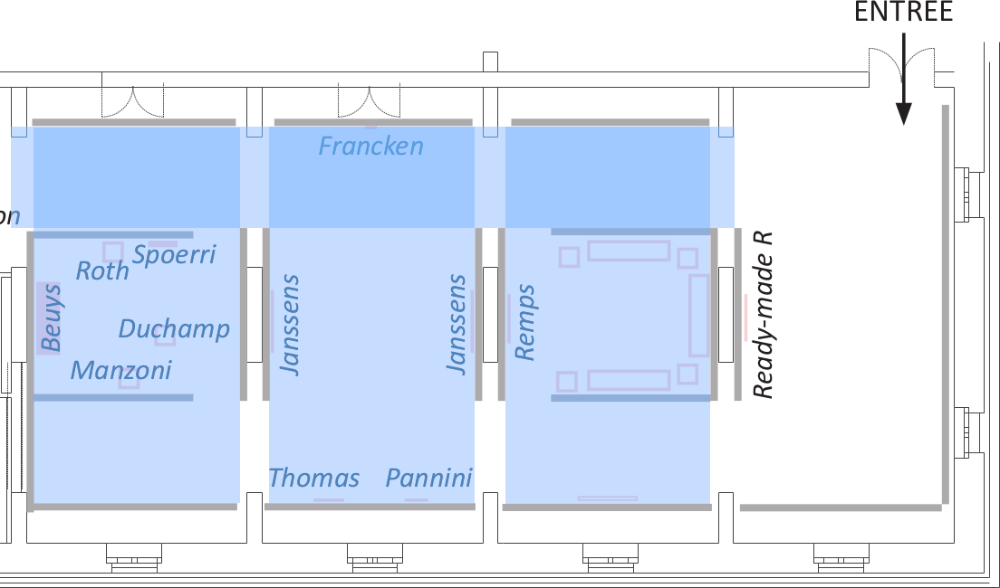
      <figcaption>
        Détail du plan de l’exposition Feux pâles au CAPC, galerie Foy. ©&#0160;Zoë&#0160;Renaudie.
      </figcaption>
    </figure>
  

  

    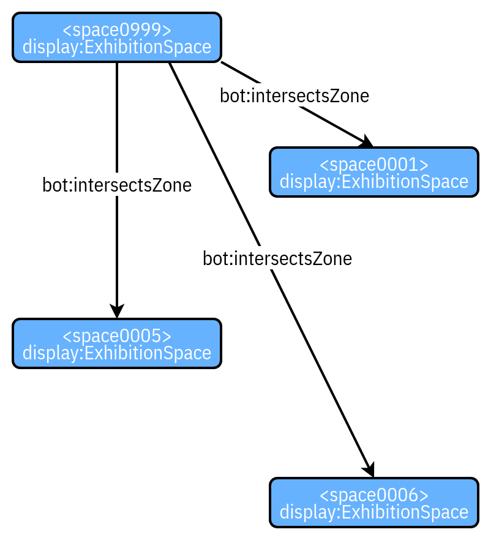
  

===vvvvvv===

## Définition des espaces d’exposition

`display:hasExhibitionSpace`: Space contains space

  

    <figure>
      
      <figcaption>
        Détail du plan de l’exposition Feux pâles au CAPC, galerie Foy. ©&#0160;Zoë&#0160;Renaudie.
      </figcaption>
    </figure>
  

  

    
  

===vvvvvv===

## Définition des espaces d’exposition

`display:hasExhibitionSpace`: Space contains space

  

    <figure>
      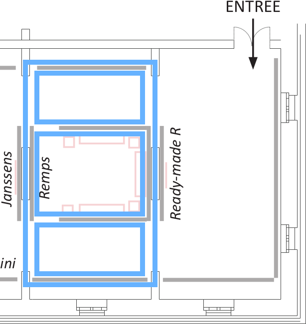
      <figcaption>
        Détail du plan de l’exposition Feux pâles au CAPC, galerie Foy. ©&#0160;Zoë&#0160;Renaudie.
      </figcaption>
    </figure>
  

  

    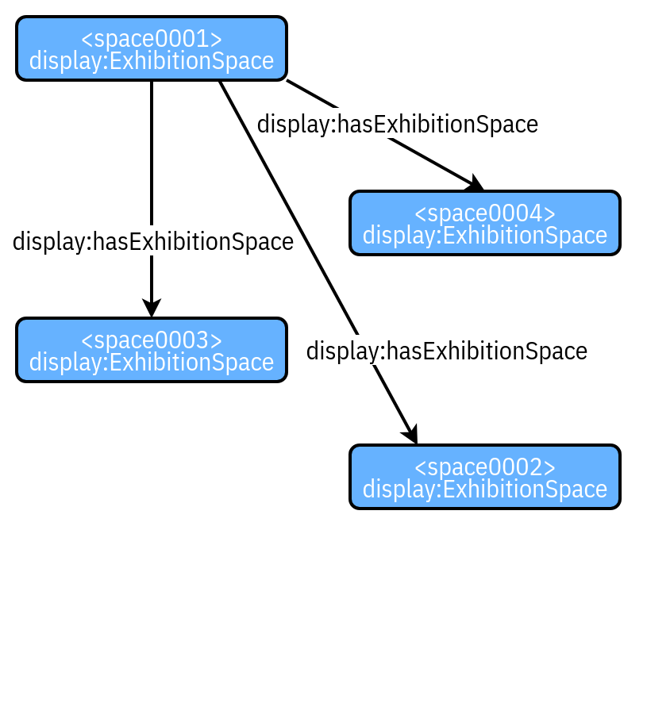
  

===vvvvvv===

## Définition des espaces d’exposition

`display:adjacentExhibit:`: Spaces share element

  

    <figure>
      
      <figcaption>
        Détail du plan de l’exposition Feux pâles au CAPC, galerie Foy. ©&#0160;Zoë&#0160;Renaudie.
      </figcaption>
    </figure>
  

  

    
  

===vvvvvv===

## Relations topologiques entre exhibits

<figure class="w75">
  
  <figcaption>
    Vue de l’exposition Feux pâles (1990), salle 1 “Inventaire du mémorable”. Photo.&#0160;: Frédéric Delpech © ©&#0160;Claire&#0160;Burrus, Paris / Jan Mot, Bruxelles.
  </figcaption>
</figure>

===vvvvvv===

## Relations topologiques entre exhibits

`display:Display`: aggregate of exhibits

===vvvvvv===

## Relations topologiques entre exhibits

`display:Display`: aggregate of exhibits

===vvvvvv===

## Relations topologiques entre exhibits

`display:Display`: aggregate of exhibits

===vvvvvv===

## Inférence : enrichir le graphe de données

===vvvvvv===

## Inférence : enrichir le graphe de données

===vvvvvv===

## Modèle de données

Un modèle de données pour articuler :

- les données structurées par l’ontologie (Display)
- les métadonnées sur les **œuvres d’art** (CIDOC CRM)

Mais surtout pour :

- faciliter l’utilisation des données dans différents contextes applicatifs grâce à une formalisation idiomatique et documentée (modèle d’API Linked Art)

/** Notes **/

- Finalement, l’élément le plus récent dans l’architecture des données
- Pour articuler, car ce n’est pas tout de dire que des exhibits sont dans l’espace
- Quelles sont elles, qui a créé ces œuvres
- Donc articuler Display avec CIDOC
- À partir de cette articulation, on peut organiser l’info dans des formats de données qui sont typiquement utilisés en programmation Web
- Basé sur un modèle d’interface de programmation, Linked Art
- Et c'est à partir de ces formats de données que l’app travaille!

===>>>>>>===

# L’application Display

===vvvvvv===

## Interface

- Une interface graphique permettant aux historiens de l’art d’alimenter l’ontologie
- recueillir des informations historiques et formuler des hypothèses
- générer un rendu de visualisation 3D et simplifié

===vvvvvv===

## Utilisateurs

- le chercheur principal
- l’auxiliaire de recherche 
- le commissaire d’exposition

===vvvvvv===

## Analyse des besoins

- Recherche dans des archives d’exposition
- Documentation lacunaire
- Comparaison d’accrochages d’une œuvre dans plusieurs projets
- Préparation d’une exposition

===vvvvvv===

## Objectifs

- Importer des listes d’œuvres directement depuis vos archives.
- Travailler sur les espaces d’exposition, même si vous ne disposez pas toujours de plans exacts ou complets.
- Localiser les œuvres dans les espaces, et visualiser comment elles étaient disposées.
- Créer des hypothèses sur la base des informations disponibles, et explorer différentes configurations possibles.

===vvvvvv===

## Fonctionnalités principales

- Importation et gestion des œuvres mais aussi des sources
- Modélisation des espaces d’exposition
- Positionnement des œuvres
- Visualisation des hypothèses

===>>>>>>===

===vvvvvv===

## [Tractr](https://www.tractr.net), notre prestataire

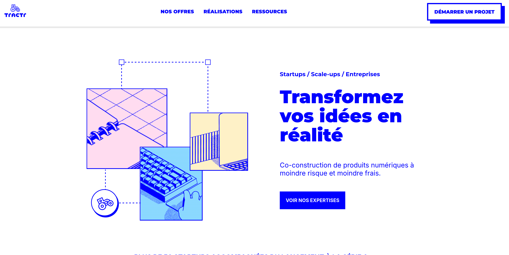

===vvvvvv===

## accueil 

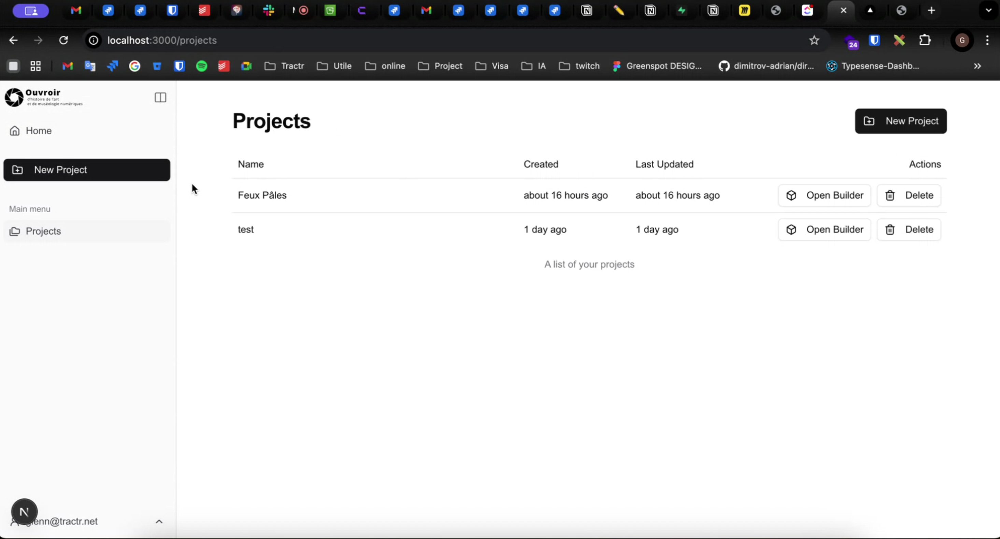

===vvvvvv===

## Capture

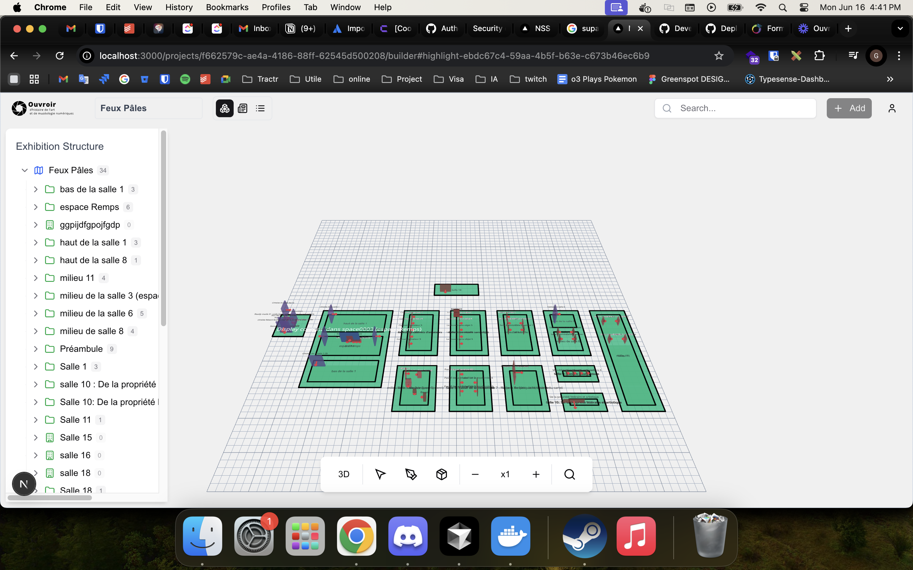

===vvvvvv===

## Capture

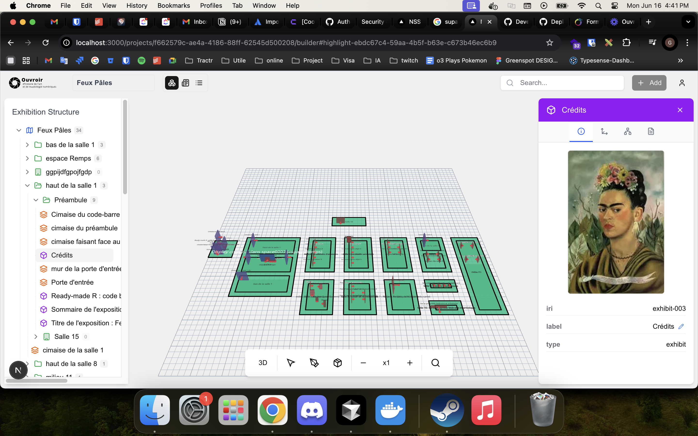

===vvvvvv===

## Capture

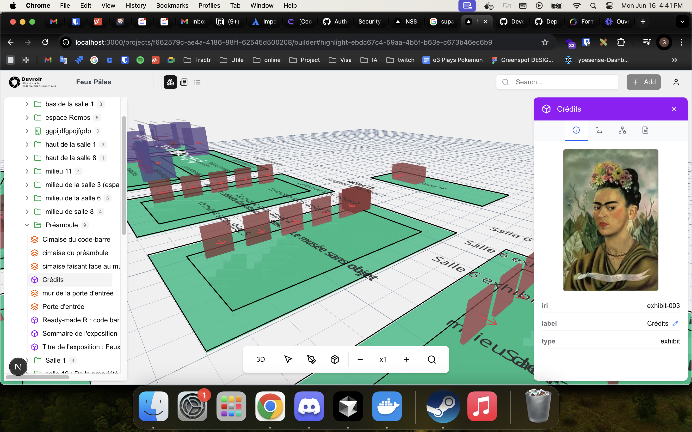

===vvvvvv===

## Capture

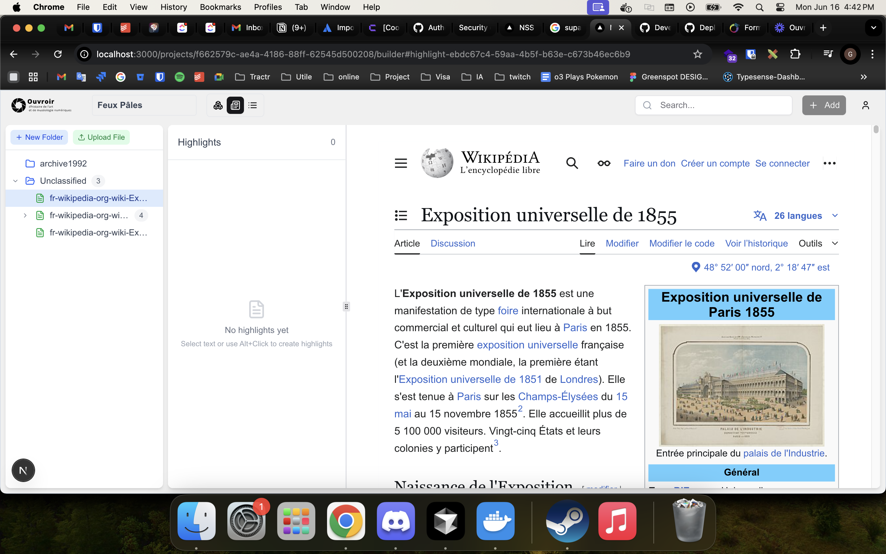

===vvvvvv===

## Capture

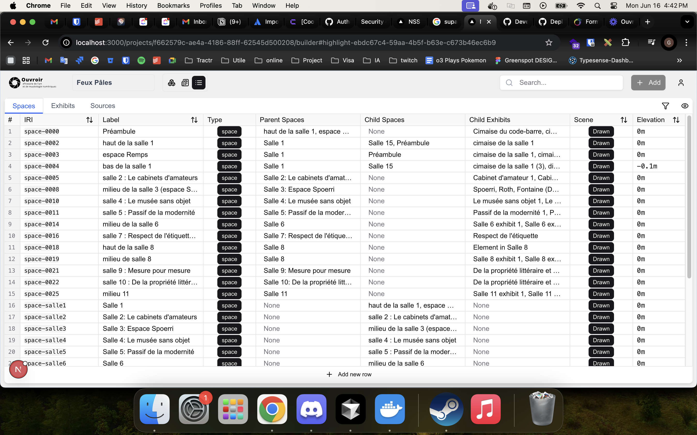

===vvvvvv===

## Capture

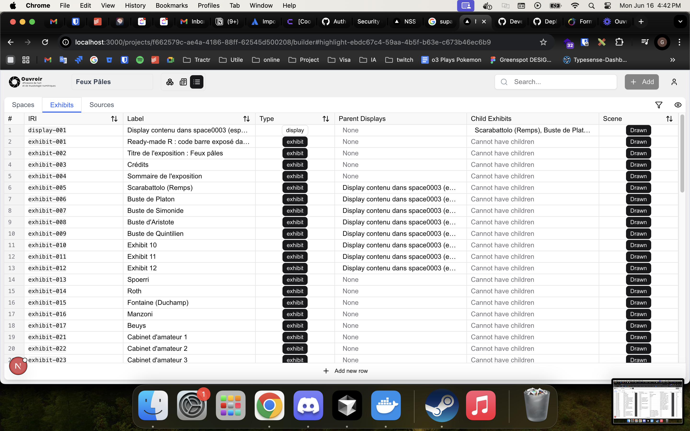

===vvvvvv===

## Capture

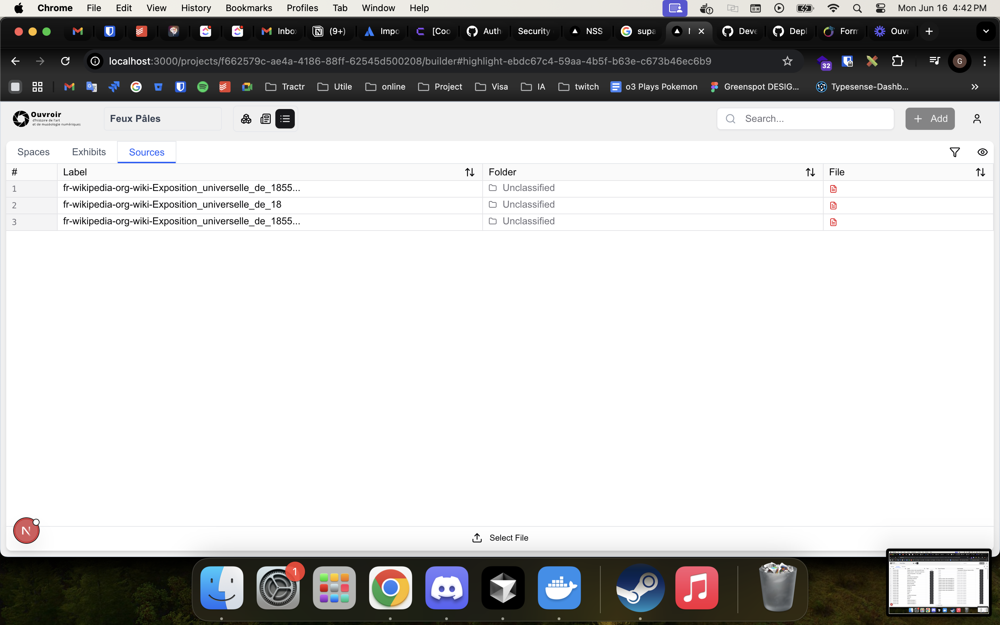

===vvvvvv===

## Capture

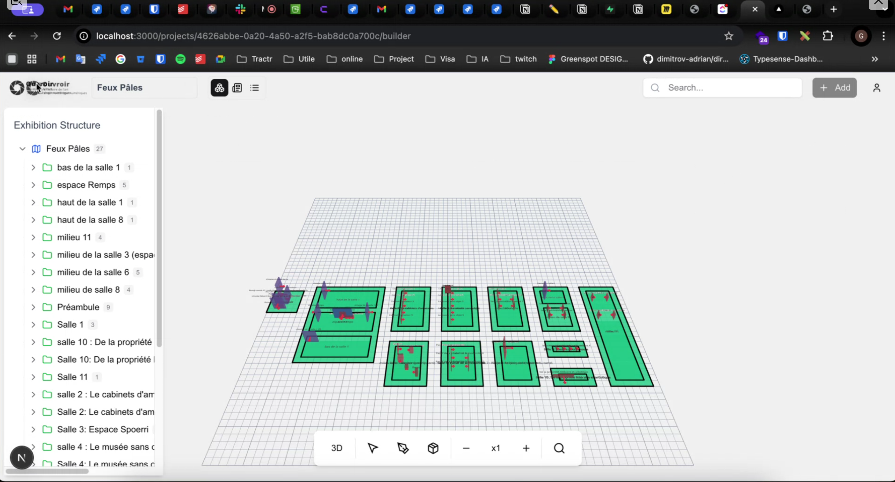

===vvvvvv===

## Démo

[lien](https://mk0w088ccoc088cws0og4ckw.tractr.ca/projects)
