<!-- ’ -->

# Display : une infrastructure sémantique pour la documentation structurée des accrochages d’exposition

**Zoë Renaudie**, **David Valentine**, et **Emmanuel Château-Dutier**

22 mai 2026

  

    
  

  

    
  

  

    
  

/** Notes **/

Le projet Display propose une infrastructure sémantique pour la documentation structurée des accrochages d’exposition. Il est développé au sein de l’Ouvroir d’histoire de l’art et de muséologie numériques sous la direction scientifique d’Emmanuel Château-Dutier, j’en ai été cheffe de projet et David Valentine l’ontologiste. Cette réalisation est conduite dans le cadre du Partenariat CIÉCO, *Des nouveaux usages des collections dans les musées d’art*  qui réunit une vingtaine de chercheurs et six musées canadiens. Marie Fraser y dirige notamment un axe de recherche sur l’histoire des accrochages de collections, pour lequel cet outil a été développé. 

La question de départ est simple, mais les difficultés pratiques sont considérables : comment reconstituer un accrochage d’exposition alors que souvent leur documentation est lacunaire, hétérogène, et parfois même contradictoire ? Comment tirer parti de ces sources de façon rigoureuse et systématique ?

Nous formulons l’hypothèse qu’une interface web adaptée aux workflows des chercheurs peut permettre à des non-experts du web sémantique de produire des données structurées selon un modèle ontologique formel, avec une qualité comparable à celle obtenue par des méthodes expertes. Notre contribution est double : méthodologique, en documentant un processus de design pour rendre le web sémantique accessible aux chercheurs en sciences humaines, et empirique, en le démontrant sur l’exposition *Feux pâles*.

Je vais vous présenter d’abord la problématique, ensuite la méthodologie du projet, puis l’architecture et les résultats, et enfin les perspectives.

===>>>>>>===

## Problématique

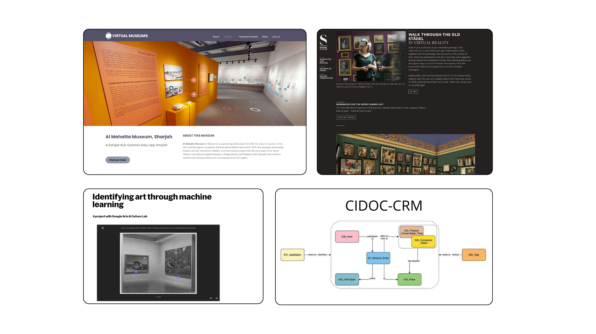

/** Notes **/

- Documentation existante : riche mais non structurée
- Absence de modèle pour la spatialité des accrochages
- Inaccessibilité du web sémantique pour les chercheurs en SHS

Ces dernières années, des institutions comme le MoMA ou la Tate ont mené des projets ambitieux de documentation de l’histoire de leurs expositions. Le MoMA Exhibition History Project documente plus de 3 500 expositions depuis 1929 avec des photographies, communiqués, listes d’œuvres. Avec le Google Arts & Culture Lab ils ont notamment utilisé un algorithme pour analyser plus de 30 000 photos d'expositions, à la recherche de correspondances avec les 65 000 œuvres de leur collection en ligne. Mais ces projets se concentrent sur la mise à disposition de documentation primaire : les relations spatiales entre les œuvres exposées ne font pas l’objet d’une description formelle. Des projets comme le Virtual Museum de l’UCLA reconstituent des expositions en 3D, mais sans structurer les données : ce qui limite toute analyse systématique des pratiques d’accrochage.

Du côté des modèles documentaires, le CIDOC-CRM offre une ontologie générique orientée événement. Des travaux plus récents comme Onto-Exhibit s’intéressent à des dimensions spécifiques de l’exposition. Mais il n’existait pas encore de modèle spécialisé pour la documentation spatiale des accrochages.

Ce n’est pas un problème mineur. Les systèmes de gestion de collections permettent de lister les œuvres et les expositions, mais rarement de modéliser où les œuvres étaient, ni comment elles se rapportaient les unes aux autres dans l’espace. Les plans d’accrochage que l’on trouve parfois dans les archives sont des outils de production, ils servent à dimensionner des cimaises, pas à documenter pour la recherche. Display ne vise d'ailleurs pas à remplacer cette documentation, ni à faire une 3D mimétique mais à combler des besoins du côté de la recherche historique.

Le troisième enjeu est celui de l’accessibilité. Le web sémantique offre un potentiel considérable pour la structuration des données culturelles, mais sa complexité technique limite son adoption. Display propose de masquer (sans effacer) cette complexité derrière des interfaces pensées pour les chercheurs en sciences humaines.

Sommairement, ce que nous cherchons à faire, c'est d'aider l'historien de l'art à étudier l'accrochage de l'exposition afin de faciliter son analyse tout lui en permettant de réutiliser ses données. 

===>>>>>>===

## Méthodologie 

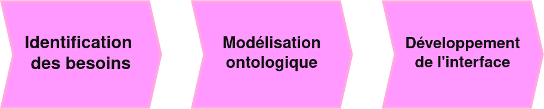

/** Notes **/

Le développement de Display n’a pas commencé par des spécifications techniques abstraites. Il a commencé sur le terrain, à partir de situations de recherche concrètes. La démarche s’est construite en trois phases qui me semble plutôt classiques, du terrain vers l’ontologie, de l’ontologie vers l’interface.

La première phase a consisté à identifier les besoins réels. Nous avons travaillé avec l’équipe de Marie Fraser pour comprendre leurs pratiques de documentation. Mon propre travail de recherche de 2017 sur l’exposition *Feux pâles* a servi de cas pilote. Elle a eu lieu en 1990, réalisée par PT sous couvers des readymade appartiennent a tt le monde au CAPC Musée d’art contemporain de Bordeaux. C’est une exposition collective majeure : 96 œuvres, 82 artistes, une scénographie complexe, et une documentation d’archive riche mais fragmentaire.

Une deuxième phase a porté sur la modélisation formelle. Des ateliers réguliers entre historiens de l’art, spécialistes du web sémantique et développeurs ont permis d’affiner progressivement le modèle ontologique. Vous le savez, cette démarche collaborative est essentielle : l’ontologie doit répondre aux besoins de la recherche tout en maintenant une rigueur formelle compatible avec les standards internationaux.

Enfin, une troisième phase a concerné le développement de l’interface, réalisé avec la société Tractr. Plusieurs cycles de tests utilisateurs ont permis d’ajuster les fonctionnalités et l’ergonomie pour cette première version prototype. Ce processus itératif a révélé l’importance de certains choix : la visualisation en 2D et en 3D, la gestion explicite des hypothèses alternatives, l’annotation directe des sources.

===>>>>>>===

## Display

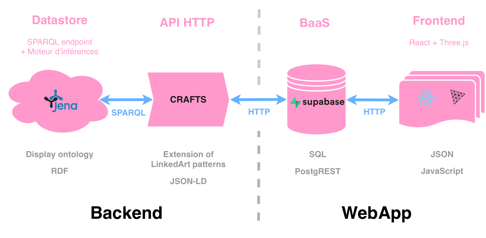

/** Notes **/

L'architecture de l'application repose sur la création d’un point d’accès SPARQL à l’aide du framework Apache Jena, associé à un moteur d'inférence. L’utilisation de CRAFTS a permis la création d’une API REST pour l’accès aux données via JSON-LD, selon des modèles proches de ceux proposés par Linked Art. Le client web propose trois vues distinctes pour la saisie et la visualisation des données : une scène 3D développée avec Three.js, un module de traitement des sources documentaires et une vue des données structurées. La conception de l’interface s’inspire des méthodes employées par les chercheurs pour documenter les expositions et permet d’explorer différentes hypothèses en s‘appuyant sur le modèle de données. 

===vvvvvv===

## L’ontologie Display

Une conceptualisation de la **topologie de l’exposition** :

- le concept d’*Exhibit* (expôt) : objet situé dans un espace d’exposition
- des **relations topologiques** abstraites entre objets et entre espaces
- ontologie `OWL`, spécialisation de l’ontologie architecturale `BOT`, et compatible avec `CIDOC-CRM`

Accessible à l’adresse <https://ouvroir.github.io/display-ontology/>.

/** Notes **/

Le cœur du projet est fondé sur une ontologie de domaine qui modélise la topologie de l’exposition.

Son unité conceptuelle centrale est l’Exhibit (expôt en francais), un objet que l’on peut situer dans un espace d’exposition, qu’il s’agisse d’une œuvre ou d’un élément scénographique. À partir de là, l’ontologie définit un vocabulaire de relations topologiques abstraites qui permettent de décrire comment les objets se positionnent les uns par rapport aux autres, et comment ils se situent dans l’espace : adjacence, contiguïté, vis-à-vis, emboîtement.

Techniquement, cette ontologie est exprimée en OWL, ce qui permet d’appliquer une logique de description au modèle. Elle s’appuie sur une spécialisation de la Building Topology Ontology (BOT) pour la description des espaces, et maintient une compatibilité avec le CIDOC-CRM pour les métadonnées sur les œuvres.

===vvvvvv===

<!-- .slide: data-background-iframe="https://ouvroir.github.io/display-ontology/" data-background-interactive class="stack" -->

===vvvvvv===

<!-- .slide: data-background-iframe="https://ouvroir.github.io/display-ontology/webvowl/index.html" data-background-interactive class="stack" -->

/** Notes **/

Voici la visualisation de l’ontologie dans WebVOWL. Je ne vais pas m’y attarder, mais elle donne une idée de la structure. Mais aujourd'hui, ce qui nous intéresse concrètement, c’est comment ce modèle s’applique à Feux pâles.

===vvvvvv===

## *Feux pâles* : les sources documentaires

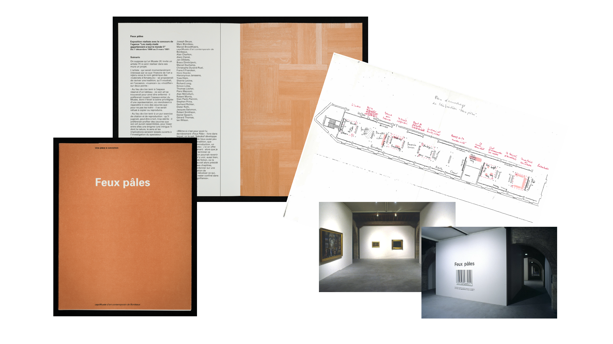

/** Notes **/

Voici le type de documentation sur laquel nous travaillons : des photographies d’installation, des plans partiels, des listes d’œuvres, des projets scénographiques, le catalogue, des entretiens, des oeuvres retournées dans leurs collections. Des sources hétérogènes, produites à des moments différents, avec des objectifs différents, mais c'est tout ce qu'il reste de l'exposition. C’est à partir de cet ensemble fragmentaire que l’on cherche à reconstituer l’accrochage.

===vvvvvv===

## Définition des espaces d’exposition

`bot:intersectsZone` : zones qui s’intersectent

  

    <figure>
      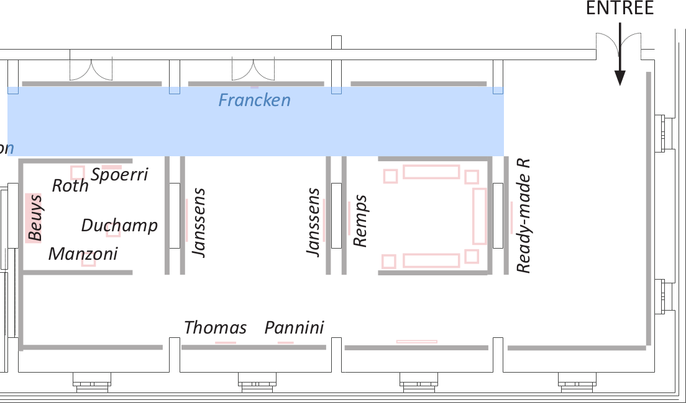
      <figcaption>
        Détail du plan, galerie Foy. ©&#0160;Zoë&#0160;Renaudie.
      </figcaption>
    </figure>
  

  

    
  

/** Notes **/

Commençons par modéliser les espaces de l’exposition. Le CAPC a une architecture complexe : des salles communicantes, des couloirs qui traversent plusieurs espaces. La propriété `bot:intersectsZone` permet de décrire ces zones qui se chevauchent, ici le couloir de la galerie Foy qui intersecte plusieurs salles.

===vvvvvv===

## Définition des espaces d’exposition

`display:hasExhibitionSpace` : espace contient espace

  

    <figure>
      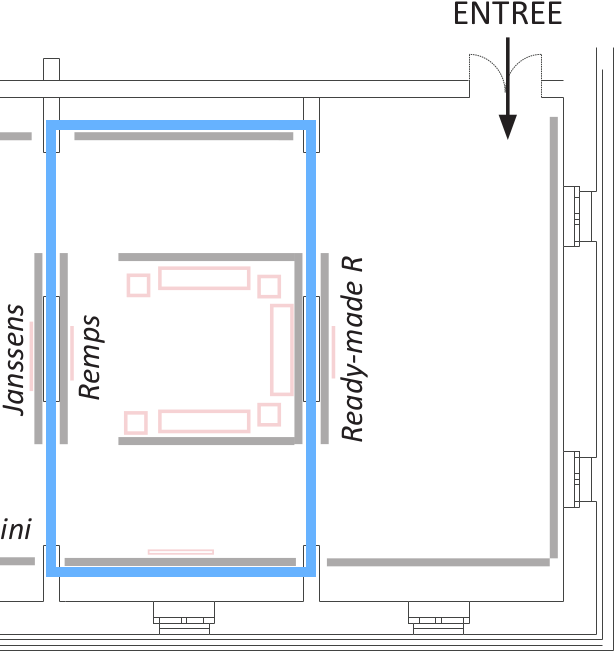
      <figcaption>
        Détail du plan, galerie Foy. ©&#0160;Zoë&#0160;Renaudie.
      </figcaption>
    </figure>
  

  

    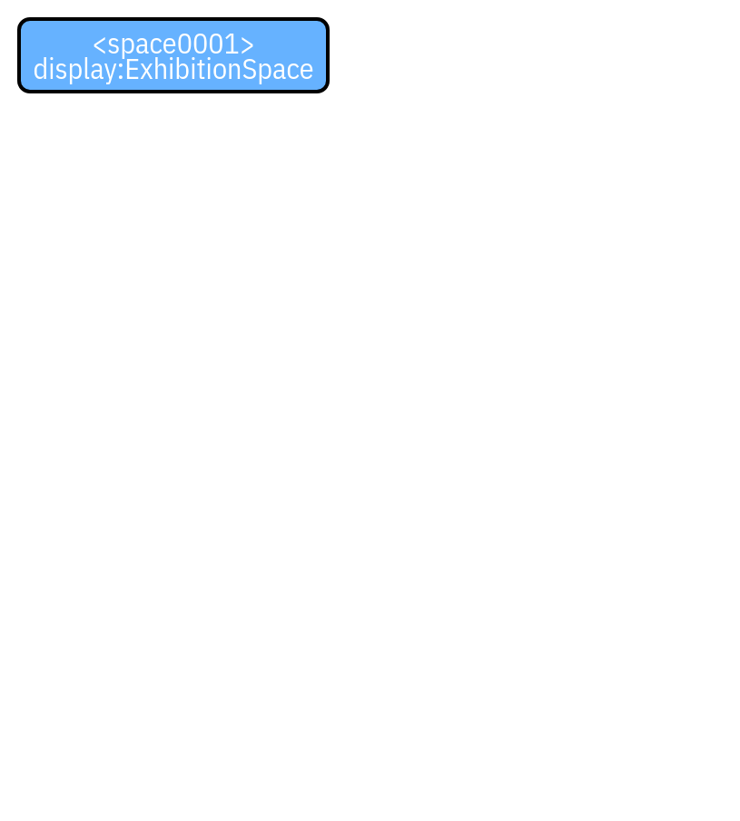
  

/** Notes **/

Ensuite, la relation d’emboîtement : une salle contient des sous-espaces. On peut ainsi décrire la hiérarchie spatiale de l’exposition, du bâtiment jusqu’à l’alcôve ou la cimaise.

===vvvvvv===

## Définition des espaces d’exposition

`display:adjacentExhibit` : espaces partageant un élément

  

    <figure>
      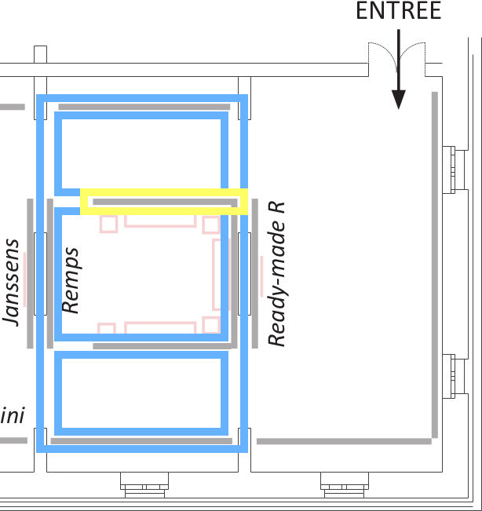
      <figcaption>
        Détail du plan, galerie Foy. ©&#0160;Zoë&#0160;Renaudie.
      </figcaption>
    </figure>
  

  

    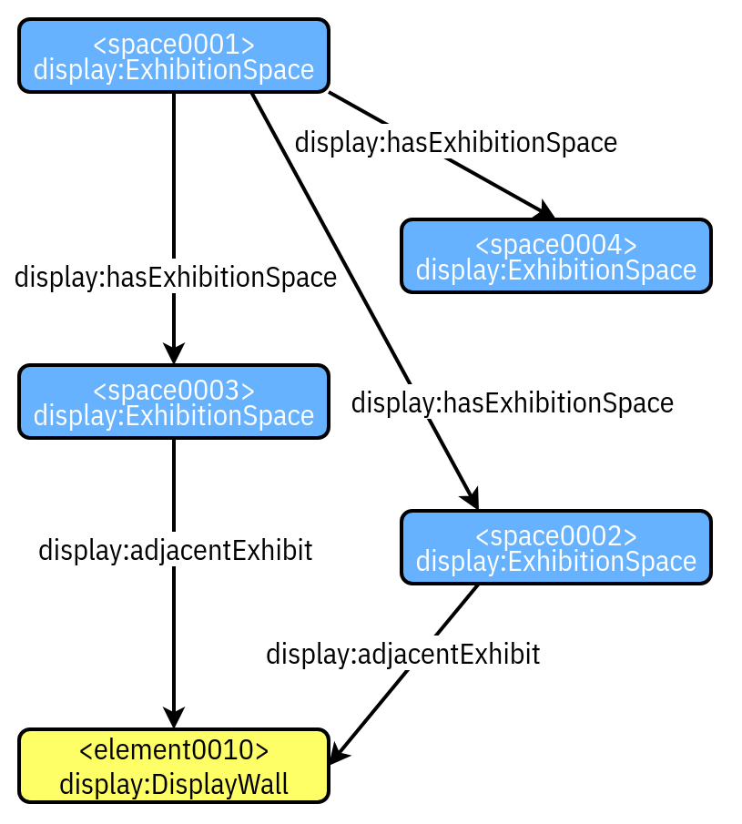
  

/** Notes **/

Enfin, l’adjacence : deux espaces qui partagent un élément architectural : une cloison, un mur, une porte. Ce vocabulaire topologique permet de décrire la géographie de l’exposition sans avoir besoin de coordonnées précises, ce qui est essentiel quand les plans sont partiels ou absents.

===vvvvvv===

## Relations topologiques entre exhibits

<figure class="w75">
  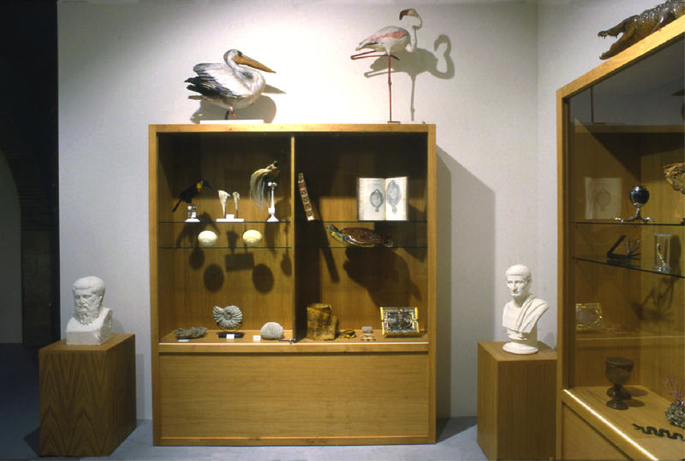
  <figcaption>
    Vue de l’exposition Feux pâles (1990), salle 1 « Inventaires du mémorable ». Photo : Frédéric Delpech ©&#0160;Claire&#0160;Burrus, Paris / Jan Mot, Bruxelles.
  </figcaption>
</figure>

/** Notes **/

Passons maintenant aux relations entre les œuvres elles-mêmes. Voici la première salle de Feux pâles, « Inventaires du mémorable ». On voit des œuvres disposées sur plusieurs murs, dans un espace ouvert. Comment décrire formellement ces configurations à partir d’une photographie ?

===vvvvvv===

## Relations topologiques entre exhibits

`display:Display` : agrégat d’exhibits

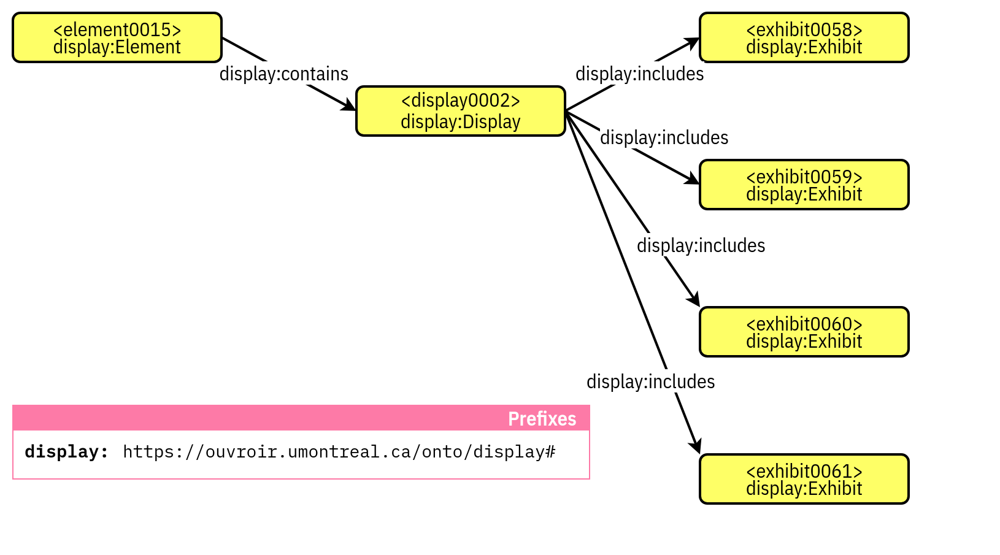

/** Notes **/

On commence par identifier les exhibits individuels, chaque œuvre visible dans la photographie. Chaque `exhibit` peut-être une instance de la classe `display` un dispositif : Display, qui peut être une œuvre, un ensemble d’œuvres, ou d'éléments scénographiques.

===vvvvvv===

## Relations topologiques entre exhibits

`display:Display` : agrégat d’exhibits

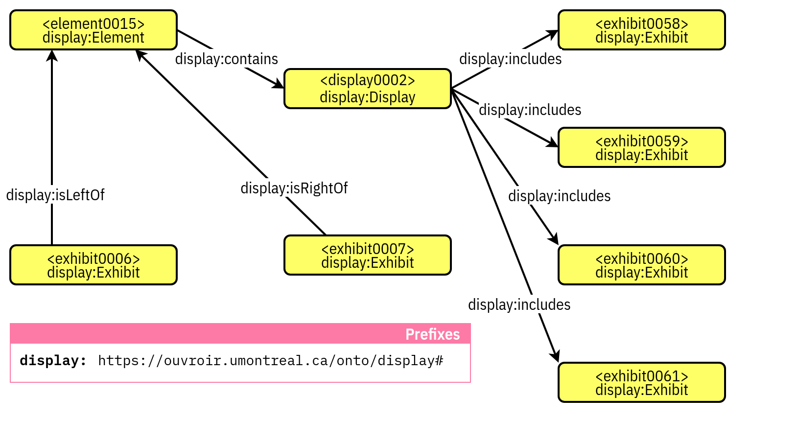

/** Notes **/

On décrit ensuite les relations entre ces exhibits : lequelle est à gauche de l’autre, lequelle est face à une autre, lesquelles partagent une même cimaise. Ce sont des relations relatives, pas des coordonnées absolues, ce qui correspond exactement à ce que l’on peut lire dans une photographie d’installation.

===vvvvvv===

## Relations topologiques entre exhibits

`display:Display` : agrégat d’exhibits

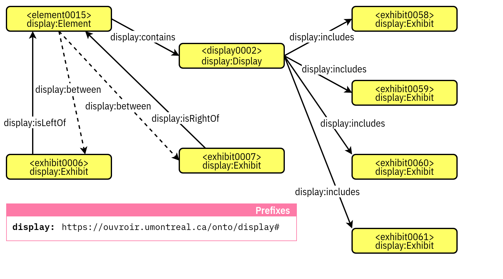

/** Notes **/

On obtient ainsi un graphe de relations entre exhibits, ancré dans les sources documentaires, et qui peut être augmenté au fur et à mesure que de nouvelles sources sont identifiées ou que de nouvelles hypothèses sont formulées.

===vvvvvv===

## Inférence : enrichir le graphe de données

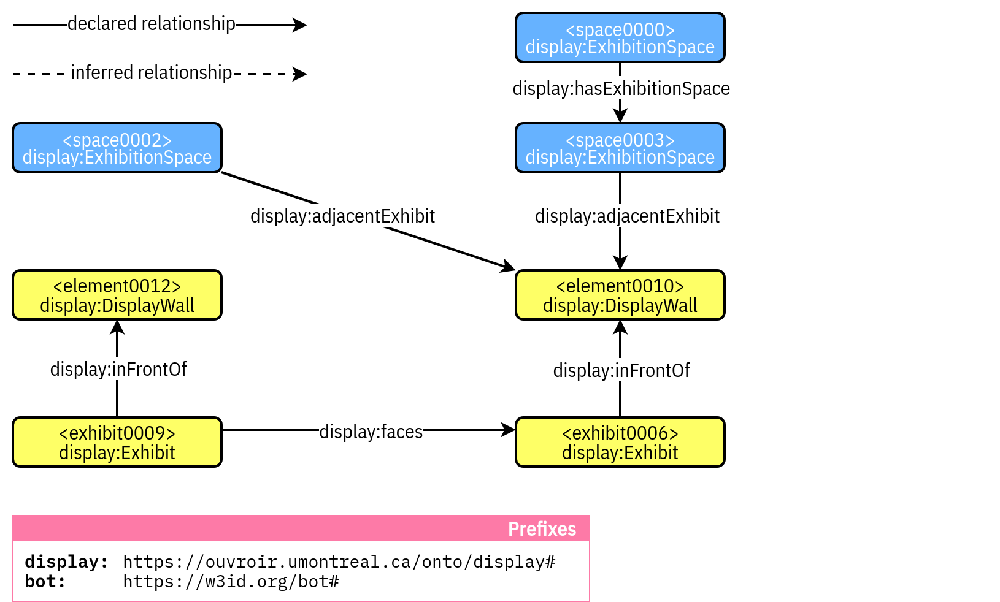

/** Notes **/

C’est ici que l’ontologie révèle sa valeur ajoutée spécifique. Si je documente qu’une œuvre A est à gauche d’une œuvre B, et que B est à gauche d’une œuvre C, le moteur d’inférence peut déduire automatiquement que A est à gauche de C, une relation que je n’ai pas eu besoin d’encoder explicitement.

===vvvvvv===

## Inférence : enrichir le graphe de données

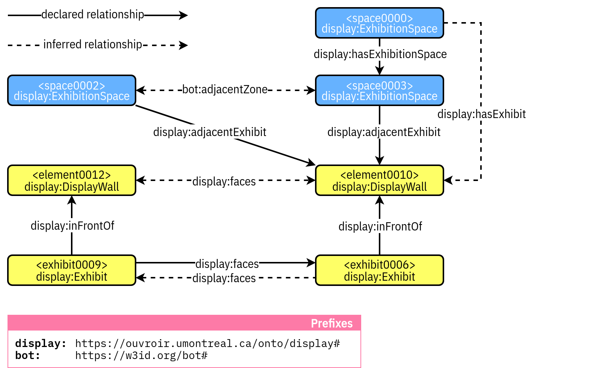

/** Notes **/

Le graphe enrichi par inférence contient donc plus de relations que ce qui a été saisi manuellement. Pour la recherche historique, cela signifie que des relations spatiales implicites dans la documentation, lisibles dans une photographie mais jamais formulées, peuvent être rendues explicites et interrogeables. C’est une forme de raisonnement automatique sur des données incertaines et partielles, ce qui est précisément la situation de la recherche sur les expositions historiques.

===vvvvvv===

## L’interface Display sur *Feux pâles*

[▶ Voir la démonstration](https://vimeo.com/XXXXXXX)

<iframe src="https://player.vimeo.com/video/1194468845?badge=0&amp;autopause=0&amp;player_id=0&amp;app_id=58479" frameborder="0" allow="autoplay; fullscreen; picture-in-picture; clipboard-write; encrypted-media; web-share" referrerpolicy="strict-origin-when-cross-origin" style="position:absolute;top:0;left:0;width:100%;height:100%;" title="demo Ouvroir"></iframe>

/** Notes **/

Voyons maintenant ce que tout cela donne du point de vue du chercheur, dans l’interface. 

Je ne pourrais pas tout vous montrer mais si vous souhaitez en savoir plus contactez nous ou venez à notre atelier prise en main à la conférence DH de cet été en Corée. 

<video controls width="80%">
  <source src="../img/demo.webm" type="video/webm">
</video>

<iframe src="https://vimeo.com/1194468845?share=copy&fl=sv&fe=ci" 
  width="80%" height="450" frameborder="0" allowfullscreen>
</iframe>

===>>>>>>===

## Résultats et bilan

- Validation sur le corpus de *Feux pâles*
- rendre le web sémantique praticable en SHS
- données structurées, interopérables, pérennes

/** Notes **/

L’application de Display a permis de valider l’hypothèse centrale sur plusieurs types de situations documentaires dans Feux pales : des œuvres dont la position est incertaine, des sources photographiques partielles qui nécessitent une interprétation, des contradictions entre sources. Dans chaque cas, Display a permis de formuler et de documenter plusieurs hypothèses de reconstitution, en explicitant pour chacune les sources mobilisées et le degré de certitude associé.

La visualisation 3D s’est révélée utile non pas comme fin en soi, mais comme outil de comparaison des hypothèses : des implications spatiales qui n’étaient pas immédiatement apparentes dans la documentation archivistique bidimensionnelle sont devenues visibles une fois les configurations modélisées en trois dimensions.

La contribution méthodologique est peut-être la plus importante à long terme. Display démontre qu’il est possible de concevoir une interface qui masque la complexité ontologique sans la trahir, que des chercheurs sans expertise en web sémantique peuvent produire des données de qualité si l’interface est pensée à partir de leurs pratiques réelles.

Du côté de la pérennité, l’utilisation de standards ouverts, OWL, RDF, SPARQL, et le développement en open source garantissent une bonne documentation de l’information et facilite la conservation et la réutilisation des données. La compatibilité avec le CIDOC-CRM et Linked Art assure l’interopérabilité avec les systèmes existants de documentation du patrimoine culturel. Les données produites ne sont pas captives d’une application : elles existent indépendamment de Display.

===>>>>>>===

## Perspectives

- enrichissement du moteur d’inférence, extraction automatique depuis les archives photographiques (IA)
- analyses à grande échelle, identification de patterns curatoriaux
- annotation des triplets (RDF*)
- au-delà de l’accrochage, vers une documentation plus complète de l’expérience expositionnelle

/** Notes **/

L'objectif était de créer un proof of concept. Nos perspectives de développement s’organisent sur plusieurs horizons.

Par exemple, l’enrichissement du moteur d’inférence permettrait des raisonnements spatiaux plus sophistiqués. L’intégration de mécanismes d’intelligence artificielle pour l’extraction automatique d’informations spatiales depuis les photographies d’archives est une piste prometteuse, réduire le temps de saisie est une condition de l’adoption de l’outil et nécessite encore quelques ajustements.

L’accumulation de données structurées sur des accrochages multiples ouvre la voie à des analyses computationnelles que l’on ne peut pas encore mener faute de données : identification de patterns curatoriaux, étude de l’évolution des pratiques d’accrochage, comparaisons entre institutions sur des périodes longues.

L’utilisation de RDF-Star (RDF*) a été explorée afin de pouvoir renseigner la source des informations enregistrées de manière granulaire. Mais pour simplifier le développement d’une première version de l’application, il a été décidé de plutôt se focaliser sur les versions de l’exposition traitées avec des graphes nommés et sur le moteur d’inférence.

Je terminerai sur une ouverture qui concerne directement ma recherche doctorale. Display modélise l’accrochage, la dimension spatiale de l’exposition. Mais une exposition ne consiste pas seulement en un accrochage. Elle forme aussi un dispositif discursif, une séquence temporelle, un ensemble de décisions curatoriales, une expérience de visite. L’enjeu des prochains développements est d’étendre le modèle vers ces autres dimensions, sans perdre la rigueur formelle qui fait la valeur du travail déjà accompli.

Je vous remercie.

API json ld mais on dispose d'un sparql endpoint. lui meme requeté par l'outil.
REST : modelisation du web. pour l'api. toutes les choses sont des ressources, qui recoive des identifiant, ces sources sont des representations. Construction d'app hypermediatiques. CRAFTS utilise API REST. on accede aux ressources par le protocole HTTP. On renvoie du jsonld. 