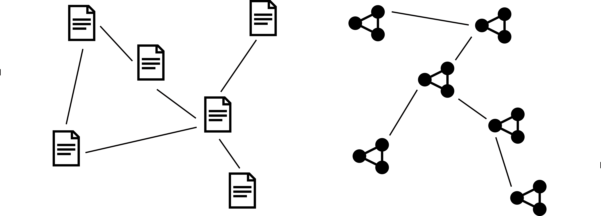
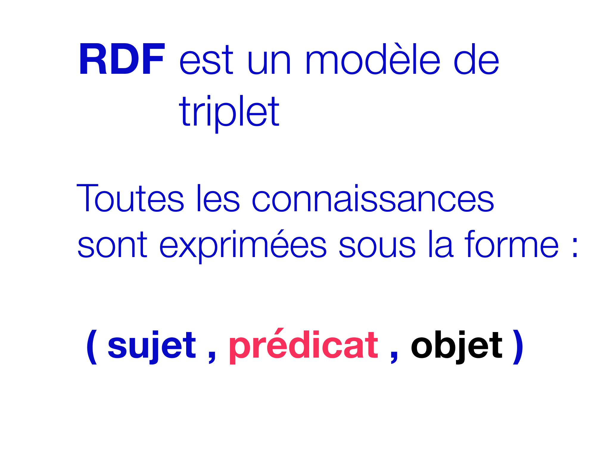
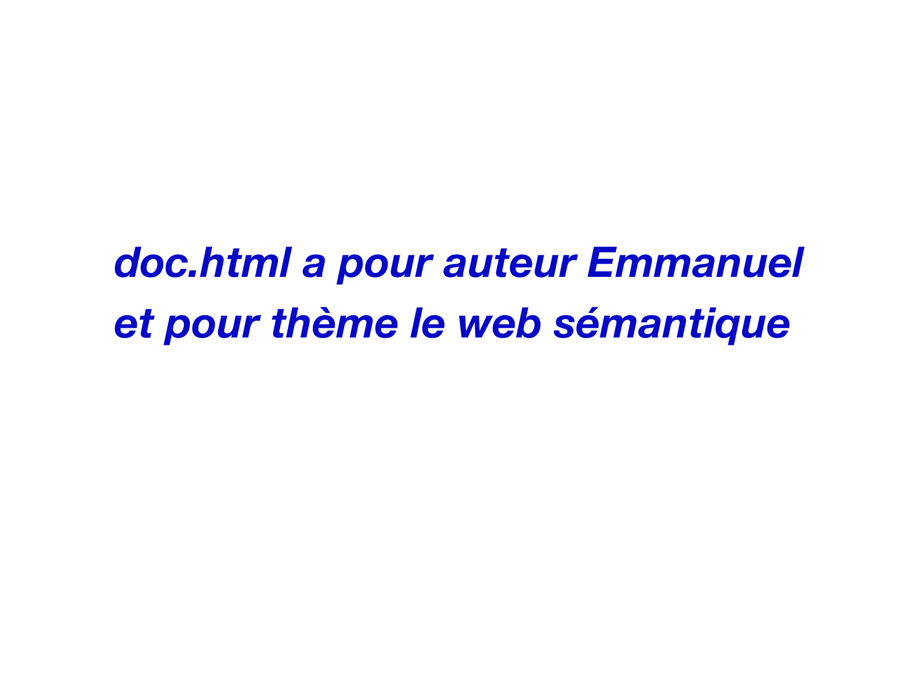
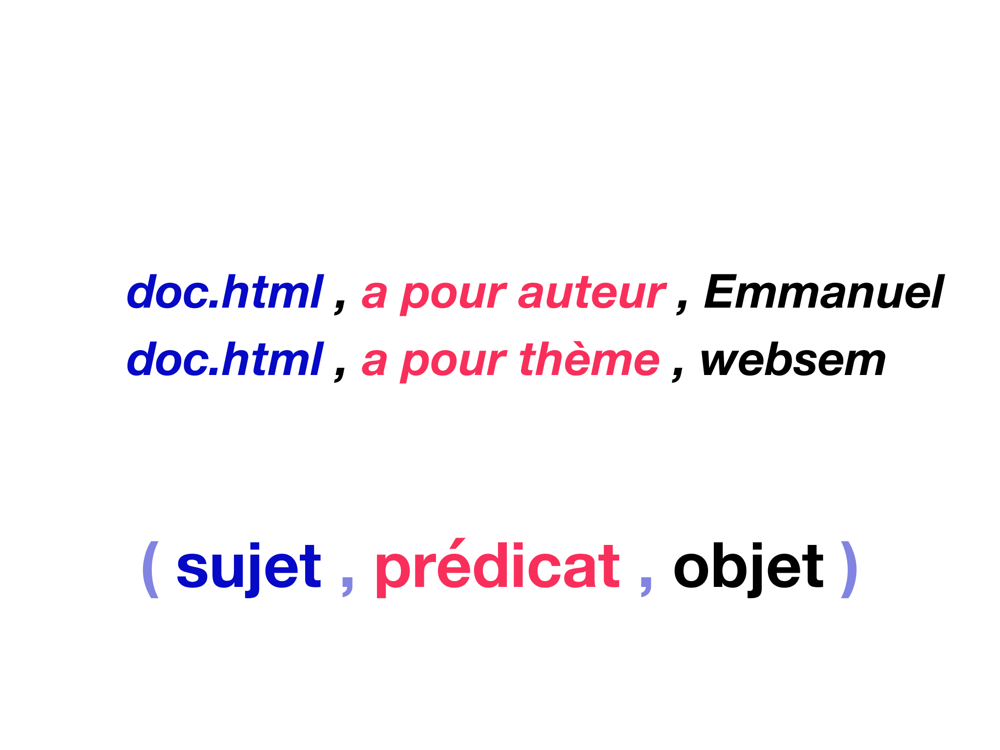
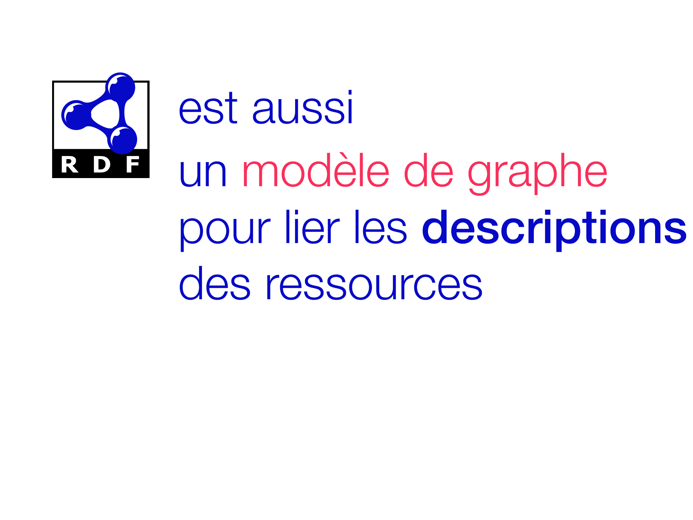
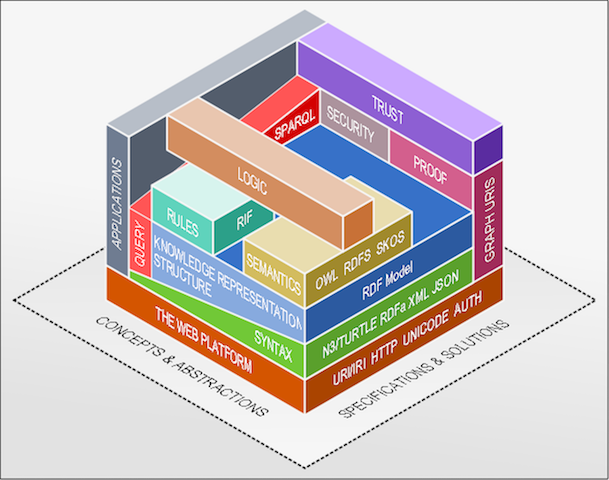
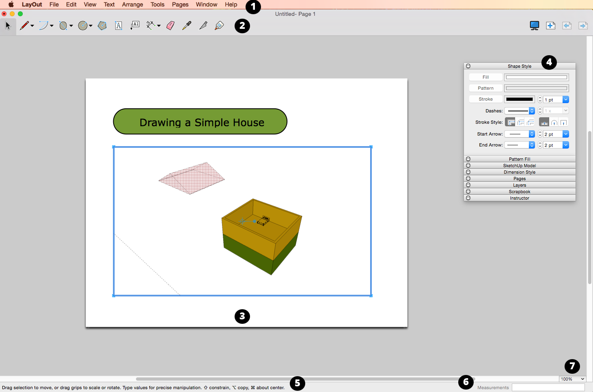
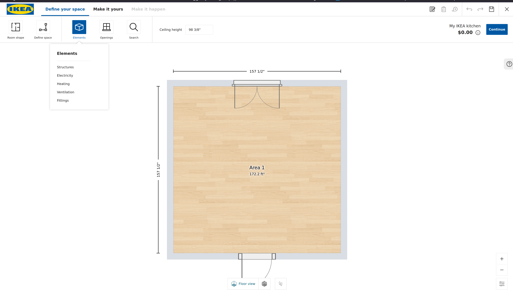
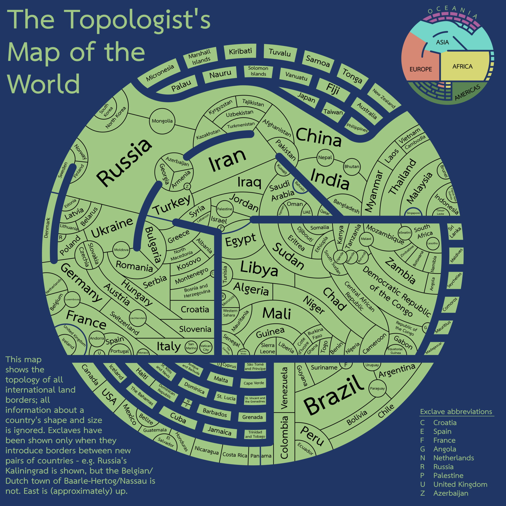

<!-- ’ -->

# Display : documenter des accrochages de collection

**Zoë&#0160;Renaudie**
**David&#0160;Valentine et Emmanuel Château-Dutier**

17 juin 2025

  

    
  

  

    
  

  

    
  

===vvvvvv===

===>>>>>>===

# Le projet Display

===vvvvvv===

## Chronologie

- 2021 : définition des besoins avec les acteurs de l’axe 1
- 2022 : étude des outils existants
- 2023 : développement de l’ontologie
- 2024 : cahier des charges fonctionnel
- 2025 : développement de l’application

===vvvvvv===

## Présentation colloque

- Journée d’étude CIECO 2023, Réflexions pour un modèle de documentation des accrochages de collection (Marie + Emmanuel + Lena)
- vitrine du CRIHN : présentation des premières expérimentations : démo de visualisation et de requêtes SPARQL
- DHNB2024 Reykjavik : présentation du projet Display
- DH2024 : présentation de l’ontologie Display

===vvvvvv===

## Les modèles de documentation patrimoniaux

- [CIDOC-CRM](http://www.cidoc-crm.org)
- [CRMgeo](doi:[10.1007/s00799-016-0192-4](https://doi.org/10.1007/s00799-016-0192-4).): A Spatiotemporal Extension of CIDOC-CRM
- [Art Tracks](http://www.museumprovenance.org)
- [OntoExhibit](https://complexhibit-project.github.io/OntoExhibit/index-en.html)
- [CRMaaa ontology](https://ontome.net/namespace/246)

**Jusqu’à présent, pas de modèle spécialisé pour la documentation des expositions ou des accrochages**

===>>>>>>===

# Le web sémantique en 3 mots

===vvvvvv===

## Web de documents vs web de données

===vvvvvv===

===vvvvvv===

===vvvvvv===

===vvvvvv===

===vvvvvv===

===vvvvvv===

===vvvvvv===

===vvvvvv===

===vvvvvv===

===vvvvvv===

===vvvvvv===

===vvvvvv===

<figure>
  
  <figcaption>
    La pile technologique du web sémantique.
  </figcaption>
</figure>

===vvvvvv===

## Les ontologies : organisation des connaissances dans le web sémantique

Une ontologie est une structure abstraite utilisée pour représenter un domaine de connaissances.

Une ontologie s’organise à la manière d’une [toxonomie](https://fr.wikipedia.org/wiki/Taxonomie_(homonymie)) (une structure de classement hiérarchique : par exemple, la classification des espèces), mais avec plus de **flexibilité**.

Une ontologie est flexible car elle fonctionne comme un [graphe](https://fr.wikipedia.org/wiki/Graphe_(type_abstrait)).

([Blaney 2017](https://programminghistorian.org/en/lessons/intro-to-linked-data))

/** Notes **/

tiré de Blaney :

- modéliser l’information dans un champ d’études
- réfléchir à la façon dont on peut représenter les relations dans ce champ
- on utilise une structure de données que l’on appelle une ontologie

> An ontology is an abstraction that allows particular knowledge about the world to be represented.
> Ontologies, in this sense, are quite new and they were designed to do what a hiearchical [taxonomy](https://en.wikipedia.org/wiki/Taxonomy) does (think of the classification of species in the [Linnaean system](https://en.wikipedia.org/wiki/Linnaean_taxonomy)), but more flexibly.

===vvvvvv===

## Les ontologies

  

    
De la hiérarchie au graphe :

  - descriptions et représentions plus fluides
  - mises en relation plus complexes des objets
    

  

    <figure>
      
      <figcaption>
        Exemple de graphe orienté acyclique (<a href="https://commons.wikimedia.org/wiki/File:Directed_acyclic_graph.svg">image publiée</a> dans le domaine public par David W.)
      </figcaption>
    </figure>
  

/** Notes **/

> An ontology is more flexible because it is non-hierarchical.
> It aims to represent the fluidity of the real world, where things can be related to each other in more complex ways than are represented by a hierarchical tree-like structure.
> Instead, an ontology is more like a spider’s web.

===vvvvvv===

## Comment s’organise une ontologie ?

- avec des **classes** qui représentent des **concepts**
- avec des **proprités** qui représentent les **relations** entre les concepts

===vvvvvv===

## La modélisation par classes

  

La classe :

  - représente un concept
  - regroupe des individus aux caractéristiques communes
  - s’organise dans une structure hiérarchique
  - hérite des caractéristiques de la classe supérieure

  

  

Relation « is-a » : héritage des caractéristiques

    <figure>
      
      <figcaption>
        Exemple de l’héritage dans la modélisation par classe.
      </figcaption>
    </figure>
  

===vvvvvv===

## L’approche associative

- définition d’associations (relations) entre les membres des classes
- utilisation de prédicat (verbe) pour créer une relation orientée (modèle RDF)

Les relations entre les membres des classes sont **transversales** à la hiérarchie de la modélisation par classe.

===vvvvvv===

## Les ontologies : des classes et des relations

Les ontologies combinent une approche taxonomique (classement des individus dans une hiérarchie) avec une approche associative (définition des relations entre les membres des classes), nous permettant de créer des modèles complexes et flexibles.

===vvvvvv===

## Les ontologies : des conceptualisations communes

Les ontologies sont des modèles auto-descriptifs très souvent publiés en ligne qui peuvent être accédés et traités par les outils qui implémentent les standards du web sémantique.

## Raisonnement et inférence

- S’ajoute une couche logique qui permet d’inférer (ou déduire) des informations
- Contraintes appliquées aux propriétés
  - Classement automatique
- Typage des propriétés
  - Symétriques
  - Transitives
  - Inverses

===vvvvvv===

## L’ontologie Display

Notre conceptualisation de la topologie de l’exposition.

Accessible en ligne : [https://w3id.org/display](https://ntnlv.ca/display/)

### Survol

- Domaine de connaisances  la topologie de l’exposition
- Classes centrales : l’espace et l’expôt
- Propriétés topologiques pour reconstituer (décrire) l’espace

===vvvvvv===

## Affichage : Noyau ontologique

Une perspective sur l'exposition basée sur :

- le concept d'*Exposition*
- les logiques spatiales (définition de relations topologiques abstraites)

===vvvvvv===

## Affichage : La conceptualisation principale

- tout se déroule dans des espaces d'exposition
- chaque entité d'exposition (artistique ou technique) est une *Exposition*

/** Notes **/

- C'est cette conceptualisation que nous souhaitons partager avec la communauté muséologique grâce aux outils du web sémantique.

===vvvvvv===

<!-- .slide: data-background-iframe="https://ouvroir.github.io/display-ontology/webvowl/index.html" data-background-interactive class="stack" -->

===>>>>>>===

# L’application Display

===vvvvvv===

## Interface

- Une interface graphique permettant aux historiens de l’art d’alimenter l’ontologie
- recueillir des informations historiques et formuler des hypothèses
- générer un rendu de visualisation 3D et simplifié

===vvvvvv===

## Personnae

- l’auxiliaire de recherche 
- le chercheur principal
- le commissaire d’exposition

===vvvvvv===

## Analyse des besoins

- Recherche dans des archives d’exposition
- Documentation lacunaire
- Comparaison d’accrochages d’une œuvre dans plusieurs projets
- Préparation d’une exposition

===vvvvvv===

## Objectifs

- Importer des listes d’œuvres directement depuis vos archives.
- Travailler sur les espaces d’exposition, même si vous ne disposez pas toujours de plans exacts ou complets.
- Localiser les œuvres dans les espaces, et visualiser comment elles étaient disposées.
- Créer des hypothèses sur la base des informations disponibles, et explorer différentes configurations possibles.

===vvvvvv===

## Exemples d’interfaces : les bases de données muséales (TMS, Mimsy, …)

===vvvvvv===

## [Sketchup](https://www.sketchup.com), Autocad

===vvvvvv===

## [Scratch](https://scratch.mit.edu/)

===vvvvvv===

## [Kitchen planner](https://kitchen.planner.ikea.com/planner/#/ca/en/)

===vvvvvv===

## [Visualisation abstraite](https://tafc.space/qna/the-topologists-world-map/)

===vvvvvv===

## [Tractr](https://www.tractr.net), notre prestataire

===vvvvvv===

## Fonctionnalités principales

- Importation et gestion des œuvres
- Modélisation des espaces d’exposition
- Positionnement des œuvres
- Visualisation des hypothèses

===>>>>>>===

## Développement en cours

===vvvvvv===

## accueil 

===vvvvvv===

## Capture

===vvvvvv===

## Capture

===vvvvvv===

## Capture

===vvvvvv===

## Capture

===vvvvvv===

## Capture

===vvvvvv===

## Capture

===vvvvvv===

## Capture

===vvvvvv===

## Capture

===vvvvvv===

## Démo

[démo](https://www.loom.com/share/7fb233c08bb249149a7d628498410d27?sid=8982ddc6-fe80-4796-a9ab-ef5dac82791a)
